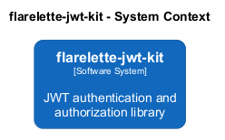

# 🏗️ flarelette-jwt-kit

**Architecture Documentation**
Generated 2025-11-01 16:48:43

## Overview

JWT authentication and authorization library

---

## System Context

The system context diagram shows how flarelette-jwt-kit fits into its environment, including external systems and users.

---

## Containers

The container diagram shows the high-level technology choices and how containers communicate.

<table>
<thead>
<tr>
<th>Container</th>
<th>Type</th>
<th>Description</th>
<th>Details</th>
</tr>
</thead>
<tbody>
<tr>
<td><strong>@chrislyons-dev/flarelette-jwt</strong></td>
<td><code>Service</code></td>
<td>Environment-driven JWT authentication for Cloudflare Workers with secret-name indirection</td>
<td><a href="./chrislyons_dev_flarelette_jwt.md">View →</a></td>
</tr>
<tr>
<td><strong>flarelette-jwt</strong></td>
<td><code>Service</code></td>
<td>Environment-driven JWT authentication for Cloudflare Workers Python with secret-name indirection</td>
<td><a href="./flarelette_jwt.md">View →</a></td>
</tr>
</tbody>
</table>

---

Generated with <a href="https://github.com/chrislyons-dev/archlette">Archlette</a> Architecture-as-Code toolkit

