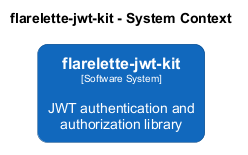
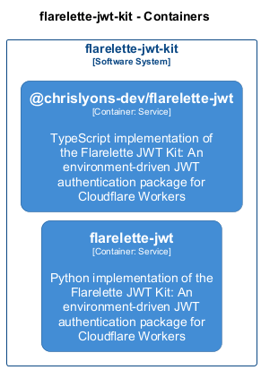

#  flarelette-jwt-kit

**Architecture Documentation**
Generated 2026-03-04 06:21:14

## Overview

JWT authentication and authorization library

---

## System Context

The system context diagram shows how flarelette-jwt-kit fits into its environment, including external systems and users.

---

## Containers

The container diagram shows the high-level technology choices and how containers communicate.

| Container | Type | Description | Details |
| --- | --- | --- | --- |
| **@chrislyons-dev/flarelette-jwt** | `Service` | TypeScript implementation of the Flarelette JWT Kit: An environment-driven JWT authentication package for Cloudflare Workers | [View](./chrislyons_dev_flarelette_jwt.md) |
| **flarelette-jwt** | `Service` | Python implementation of the Flarelette JWT Kit: An environment-driven JWT authentication package for Cloudflare Workers | [View](./flarelette_jwt.md) |

---

Generated with <a href="https://github.com/chrislyons-dev/archlette">Archlette</a> Architecture-as-Code toolkit

