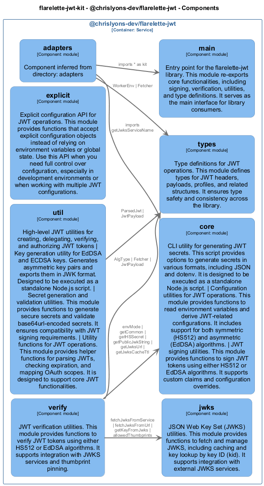

# @chrislyons-dev/flarelette-jwt

[← Back to System Overview](./README.md)

---

## Container Context

---

## Container Information

| Field | Value |
| --- | --- |
| **Name** | @chrislyons-dev/flarelette-jwt |
| **Type** | `Service` |
| **Description** | TypeScript implementation of the Flarelette JWT Kit: An environment-driven JWT authentication package for Cloudflare Workers || **Tags** | `Auto-generated` |
---

## Components

### Component View

### Component Details

| Component | Type | Description | Code |
| --- | --- | --- | --- |
| **core** | `module` | CLI utility for generating JWT secrets.  This script provides options to generate secrets in various formats, including JSON and dotenv. It is designed to be executed as a standalone Node.js script. \| Configuration utilities for JWT operations.  This module provides functions to read environment variables and derive JWT-related configurations. It includes support for both symmetric (HS512) and asymmetric (EdDSA) algorithms. \| JWT signing utilities.  This module provides functions to sign JWT tokens using either HS512 or EdDSA algorithms. It supports custom claims and configuration overrides. | [View](./chrislyons_dev_flarelette_jwt__core.md) |
| **explicit** | `module` | Explicit configuration API for JWT operations.  This module provides functions that accept explicit configuration objects instead of relying on environment variables or global state. Use this API when you need full control over configuration, especially in development environments or when working with multiple JWT configurations. | [View](./chrislyons_dev_flarelette_jwt__explicit.md) |
| **util** | `module` | High-level JWT utilities for creating, delegating, verifying, and authorizing JWT tokens \| Key generation utility for EdDSA and ECDSA keys.  Generates asymmetric key pairs and exports them in JWK format. Designed to be executed as a standalone Node.js script. \| Secret generation and validation utilities.  This module provides functions to generate secure secrets and validate base64url-encoded secrets. It ensures compatibility with JWT signing requirements. \| Utility functions for JWT operations.  This module provides helper functions for parsing JWTs, checking expiration, and mapping OAuth scopes. It is designed to support core JWT functionalities. | [View](./chrislyons_dev_flarelette_jwt__util.md) |
| **main** | `module` | Entry point for the flarelette-jwt library.  This module re-exports core functionalities, including signing, verification, utilities, and type definitions. It serves as the main interface for library consumers. | [View](./chrislyons_dev_flarelette_jwt__main.md) |
| **jwks** | `module` | JSON Web Key Set (JWKS) utilities.  This module provides functions to fetch and manage JWKS, including caching and key lookup by key ID (kid). It supports integration with external JWKS services. | [View](./chrislyons_dev_flarelette_jwt__jwks.md) |
| **types** | `module` | Type definitions for JWT operations.  This module defines types for JWT headers, payloads, profiles, and related structures. It ensures type safety and consistency across the library. | [View](./chrislyons_dev_flarelette_jwt__types.md) |
| **verify** | `module` | JWT verification utilities.  This module provides functions to verify JWT tokens using either HS512 or EdDSA algorithms. It supports integration with JWKS services and thumbprint pinning. | [View](./chrislyons_dev_flarelette_jwt__verify.md) |
| **adapters** | `module` | Component inferred from directory: adapters | [View](./chrislyons_dev_flarelette_jwt__adapters.md) |

---

<a href="./README.md">← Back to System Overview</a> | Generated with <a href="https://github.com/chrislyons-dev/archlette">Archlette</a>

