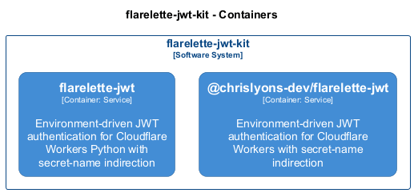

# @chrislyons-dev/flarelette-jwt

[← Back to System Overview](./README.md)

---

## Container Context

---

## Container Information

<table>
<tbody>
<tr>
<td><strong>Name</strong></td>
<td>@chrislyons-dev/flarelette-jwt</td>
</tr>
<tr>
<td><strong>Type</strong></td>
<td><code>Service</code></td>
</tr>
<tr>
<td><strong>Description</strong></td>
<td>Environment-driven JWT authentication for Cloudflare Workers with secret-name indirection</td>
</tr>
<tr>
<td><strong>Tags</strong></td>
<td><code>Auto-generated</code></td>
</tr>
</tbody>
</table>

---

## Components

### Component View

### Component Details

<table>
<thead>
<tr>
<th>Component</th>
<th>Type</th>
<th>Description</th>
<th>Code</th>
</tr>
</thead>
<tbody>
<tr>
<td><strong>src</strong></td>
<td><code>module</code></td>
<td>Component inferred from directory: src</td>
<td><a href="./chrislyons_dev_flarelette_jwt__src.md">View →</a></td>
</tr>
<tr>
<td><strong>adapters</strong></td>
<td><code>module</code></td>
<td>Component inferred from directory: adapters</td>
<td><a href="./chrislyons_dev_flarelette_jwt__adapters.md">View →</a></td>
</tr>
</tbody>
</table>

---

<a href="./README.md">← Back to System Overview</a> | Generated with <a href="https://github.com/chrislyons-dev/archlette">Archlette</a>

