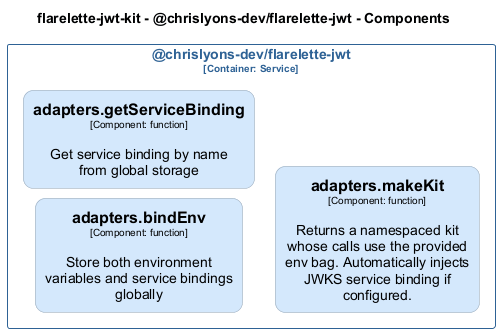

# adapters — Code View

[← Back to Container](./chrislyons_dev_flarelette_jwt.md) | [← Back to System](./README.md)

---

## Component Information

<table>
<tbody>
<tr>
<td><strong>Component</strong></td>
<td>adapters</td>
</tr>
<tr>
<td><strong>Container</strong></td>
<td>@chrislyons-dev/flarelette-jwt</td>
</tr>
<tr>
<td><strong>Type</strong></td>
<td><code>module</code></td>
</tr>
<tr>
<td><strong>Description</strong></td>
<td>Component inferred from directory: adapters</td>
</tr>
</tbody>
</table>

---

## Code Structure

### Class Diagram

### Code Elements

<strong>3 code element(s)</strong>

#### Functions

##### `bindEnv()`

Store both environment variables and service bindings globally

<table>
<tbody>
<tr>
<td><strong>Type</strong></td>
<td><code>function</code></td>
</tr>
<tr>
<td><strong>Visibility</strong></td>
<td><code>public</code></td>
</tr>
<tr>
<td><strong>Returns</strong></td>
<td><code>void</code></td>
</tr>
<tr>
<td><strong>Location</strong></td>
<td><code>C:/Users/chris/git/flarelette-jwt-kit/packages/flarelette-jwt-ts/src/adapters/hono.ts:13</code></td>
</tr>
</tbody>
</table>

**Parameters:**

- `env`: <code>import("C:/Users/chris/git/flarelette-jwt-kit/packages/flarelette-jwt-ts/src/types").WorkerEnv</code>

---
##### `getServiceBinding()`

Get service binding by name from global storage

<table>
<tbody>
<tr>
<td><strong>Type</strong></td>
<td><code>function</code></td>
</tr>
<tr>
<td><strong>Visibility</strong></td>
<td><code>private</code></td>
</tr>
<tr>
<td><strong>Returns</strong></td>
<td><code>import("C:/Users/chris/git/flarelette-jwt-kit/packages/flarelette-jwt-ts/src/types").Fetcher</code></td>
</tr>
<tr>
<td><strong>Location</strong></td>
<td><code>C:/Users/chris/git/flarelette-jwt-kit/packages/flarelette-jwt-ts/src/adapters/hono.ts:35</code></td>
</tr>
</tbody>
</table>

**Parameters:**

- `name`: <code>string</code>

---
##### `makeKit()`

Returns a namespaced kit whose calls use the provided env bag.
Automatically injects JWKS service binding if configured.

<table>
<tbody>
<tr>
<td><strong>Type</strong></td>
<td><code>function</code></td>
</tr>
<tr>
<td><strong>Visibility</strong></td>
<td><code>public</code></td>
</tr>
<tr>
<td><strong>Returns</strong></td>
<td><code>{ sign: typeof import("C:/Users/chris/git/flarelette-jwt-kit/packages/flarelette-jwt-ts/src/sign").sign; verify: (token: string, opts?: Partial<{ iss: string; aud: string; leeway: number; }>) => Promise<any>; createToken: typeof import("C:/Users/chris/git/flarelette-jwt-kit/packages/flarelette-jwt-ts/src/high").createToken; checkAuth: (token: string, opts?: import("C:/Users/chris/git/flarelette-jwt-kit/packages/flarelette-jwt-ts/src/high").AuthzOpts) => Promise<import("C:/Users/chris/git/flarelette-jwt-kit/packages/flarelette-jwt-ts/src/high").AuthUser>; policy: typeof import("C:/Users/chris/git/flarelette-jwt-kit/packages/flarelette-jwt-ts/src/high").policy; parse: typeof import("C:/Users/chris/git/flarelette-jwt-kit/packages/flarelette-jwt-ts/src/util").parse; isExpiringSoon: typeof import("C:/Users/chris/git/flarelette-jwt-kit/packages/flarelette-jwt-ts/src/util").isExpiringSoon; }</code></td>
</tr>
<tr>
<td><strong>Location</strong></td>
<td><code>C:/Users/chris/git/flarelette-jwt-kit/packages/flarelette-jwt-ts/src/adapters/hono.ts:45</code></td>
</tr>
</tbody>
</table>

**Parameters:**

- `env`: <code>import("C:/Users/chris/git/flarelette-jwt-kit/packages/flarelette-jwt-ts/src/types").WorkerEnv</code>

---

---

<a href="./chrislyons_dev_flarelette_jwt.md">← Back to Container</a> | <a href="./README.md">← Back to System</a> | Generated with <a href="https://github.com/chrislyons-dev/archlette">Archlette</a>

