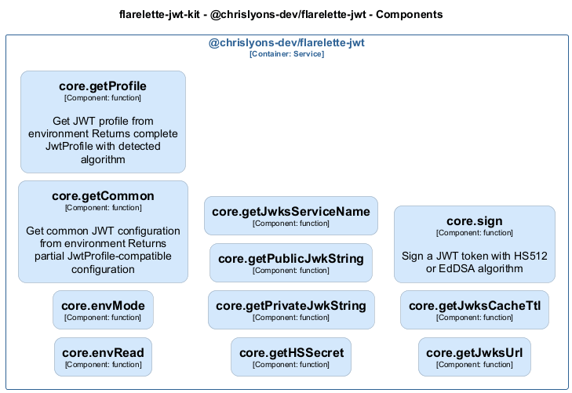

# core — Code View

[← Back to Container](./chrislyons_dev_flarelette_jwt.md) | [← Back to System](./README.md)

---

## Component Information

| Field | Value |
| --- | --- |
| **Component** | core |
| **Container** | @chrislyons-dev/flarelette-jwt |
| **Type** | `module` |
| **Description** | CLI utility for generating JWT secrets.  This script provides options to generate secrets in various formats, including JSON and dotenv. It is designed to be executed as a standalone Node.js script. \| Configuration utilities for JWT operations.  This module provides functions to read environment variables and derive JWT-related configurations. It includes support for both symmetric (HS512) and asymmetric (EdDSA) algorithms. \| JWT signing utilities.  This module provides functions to sign JWT tokens using either HS512 or EdDSA algorithms. It supports custom claims and configuration overrides. |
---

## Code Structure

### Class Diagram

### Code Elements

<strong>11 code element(s)</strong>

#### Functions

##### `envRead()`

| Field | Value |
| --- | --- |
| **Type** | `function` |
| **Visibility** | `private` |
| **Returns** | `string` || **Location** | `C:/Users/chris/git/flarelette-jwt-kit/packages/flarelette-jwt-ts/src/config.ts:13` |

**Parameters:**

- `name`: <code>string</code>

---
##### `envMode()`

| Field | Value |
| --- | --- |
| **Type** | `function` |
| **Visibility** | `public` |
| **Returns** | `import("C:/Users/chris/git/flarelette-jwt-kit/packages/flarelette-jwt-ts/src/types").AlgType` || **Location** | `C:/Users/chris/git/flarelette-jwt-kit/packages/flarelette-jwt-ts/src/config.ts:23` |

**Parameters:**

- `role`: <code>"producer" | "consumer"</code>

---
##### `getCommon()`

Get common JWT configuration from environment
Returns partial JwtProfile-compatible configuration

| Field | Value |
| --- | --- |
| **Type** | `function` |
| **Visibility** | `public` |
| **Returns** | `{ iss: string; aud: string; leeway: number; ttlSeconds: number; }` || **Location** | `C:/Users/chris/git/flarelette-jwt-kit/packages/flarelette-jwt-ts/src/config.ts:66` |

---
##### `getProfile()`

Get JWT profile from environment
Returns complete JwtProfile with detected algorithm

| Field | Value |
| --- | --- |
| **Type** | `function` |
| **Visibility** | `public` |
| **Returns** | `Partial<import("C:/Users/chris/git/flarelette-jwt-kit/packages/flarelette-jwt-ts/src/types").JwtProfile> & { ttlSeconds: number; }` || **Location** | `C:/Users/chris/git/flarelette-jwt-kit/packages/flarelette-jwt-ts/src/config.ts:79` |

**Parameters:**

- `role`: <code>"producer" | "consumer"</code>

---
##### `getHSSecret()`

| Field | Value |
| --- | --- |
| **Type** | `function` |
| **Visibility** | `public` |
| **Returns** | `Uint8Array<ArrayBufferLike>` || **Location** | `C:/Users/chris/git/flarelette-jwt-kit/packages/flarelette-jwt-ts/src/config.ts:94` |

---
##### `getPrivateJwkString()`

| Field | Value |
| --- | --- |
| **Type** | `function` |
| **Visibility** | `public` |
| **Returns** | `string` || **Location** | `C:/Users/chris/git/flarelette-jwt-kit/packages/flarelette-jwt-ts/src/config.ts:127` |

---
##### `getPublicJwkString()`

| Field | Value |
| --- | --- |
| **Type** | `function` |
| **Visibility** | `public` |
| **Returns** | `string` || **Location** | `C:/Users/chris/git/flarelette-jwt-kit/packages/flarelette-jwt-ts/src/config.ts:133` |

---
##### `getJwksServiceName()`

| Field | Value |
| --- | --- |
| **Type** | `function` |
| **Visibility** | `public` |
| **Returns** | `string` || **Location** | `C:/Users/chris/git/flarelette-jwt-kit/packages/flarelette-jwt-ts/src/config.ts:139` |

---
##### `getJwksUrl()`

| Field | Value |
| --- | --- |
| **Type** | `function` |
| **Visibility** | `public` |
| **Returns** | `string` || **Location** | `C:/Users/chris/git/flarelette-jwt-kit/packages/flarelette-jwt-ts/src/config.ts:145` |

---
##### `getJwksCacheTtl()`

| Field | Value |
| --- | --- |
| **Type** | `function` |
| **Visibility** | `public` |
| **Returns** | `number` || **Location** | `C:/Users/chris/git/flarelette-jwt-kit/packages/flarelette-jwt-ts/src/config.ts:151` |

---
##### `sign()`

Sign a JWT token with HS512 or EdDSA algorithm

| Field | Value |
| --- | --- |
| **Type** | `function` |
| **Visibility** | `public` |
| **Async** | Yes || **Returns** | `Promise<string>` - Signed JWT token string || **Location** | `C:/Users/chris/git/flarelette-jwt-kit/packages/flarelette-jwt-ts/src/sign.ts:22` |

**Parameters:**

- `payload`: <code>import("C:/Users/chris/git/flarelette-jwt-kit/packages/flarelette-jwt-ts/src/types").JwtPayload</code> — - Claims to include in the token (can include custom claims beyond standard JWT fields)- `opts`: <code>Partial<{ iss: string; aud: string | string[]; ttlSeconds: number; }></code> — - Optional overrides for iss, aud, ttlSeconds

---

---

<a href="./chrislyons_dev_flarelette_jwt.md">← Back to Container</a> | <a href="./README.md">← Back to System</a> | Generated with <a href="https://github.com/chrislyons-dev/archlette">Archlette</a>

