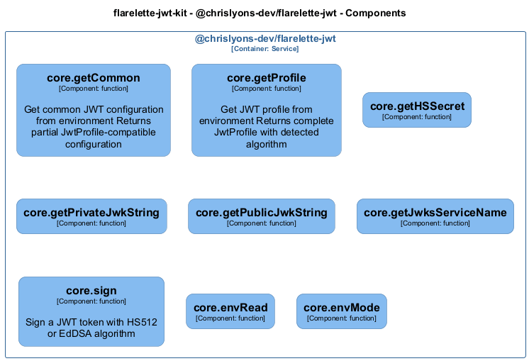

# core — Code View

[← Back to Container](./chrislyons_dev_flarelette_jwt.md) | [← Back to System](./README.md)

---

## Component Information

<table>
<tbody>
<tr>
<td><strong>Component</strong></td>
<td>core</td>
</tr>
<tr>
<td><strong>Container</strong></td>
<td>@chrislyons-dev/flarelette-jwt</td>
</tr>
<tr>
<td><strong>Type</strong></td>
<td><code>module</code></td>
</tr>
<tr>
<td><strong>Description</strong></td>
<td>CLI utility for generating JWT secrets.

This script provides options to generate secrets in various formats, including JSON and dotenv.
It is designed to be executed as a standalone Node.js script. | Configuration utilities for JWT operations.

This module provides functions to read environment variables and derive JWT-related configurations.
It includes support for both symmetric (HS512) and asymmetric (EdDSA) algorithms. | JWT signing utilities.

This module provides functions to sign JWT tokens using either HS512 or EdDSA algorithms.
It supports custom claims and configuration overrides.</td>
</tr>
</tbody>
</table>

---

## Code Structure

### Class Diagram

### Code Elements

<strong>9 code element(s)</strong>

#### Functions

##### `envRead()`

<table>
<tbody>
<tr>
<td><strong>Type</strong></td>
<td><code>function</code></td>
</tr>
<tr>
<td><strong>Visibility</strong></td>
<td><code>private</code></td>
</tr>
<tr>
<td><strong>Returns</strong></td>
<td><code>string</code></td>
</tr>
<tr>
<td><strong>Location</strong></td>
<td><code>C:/Users/chris/git/flarelette-jwt-kit/packages/flarelette-jwt-ts/src/config.ts:13</code></td>
</tr>
</tbody>
</table>

**Parameters:**

- `name`: <code>string</code>

---
##### `envMode()`

<table>
<tbody>
<tr>
<td><strong>Type</strong></td>
<td><code>function</code></td>
</tr>
<tr>
<td><strong>Visibility</strong></td>
<td><code>public</code></td>
</tr>
<tr>
<td><strong>Returns</strong></td>
<td><code>import("C:/Users/chris/git/flarelette-jwt-kit/packages/flarelette-jwt-ts/src/types").AlgType</code></td>
</tr>
<tr>
<td><strong>Location</strong></td>
<td><code>C:/Users/chris/git/flarelette-jwt-kit/packages/flarelette-jwt-ts/src/config.ts:23</code></td>
</tr>
</tbody>
</table>

**Parameters:**

- `role`: <code>"producer" | "consumer"</code>

---
##### `getCommon()`

Get common JWT configuration from environment
Returns partial JwtProfile-compatible configuration

<table>
<tbody>
<tr>
<td><strong>Type</strong></td>
<td><code>function</code></td>
</tr>
<tr>
<td><strong>Visibility</strong></td>
<td><code>public</code></td>
</tr>
<tr>
<td><strong>Returns</strong></td>
<td><code>{ iss: string; aud: string; leeway: number; ttlSeconds: number; }</code></td>
</tr>
<tr>
<td><strong>Location</strong></td>
<td><code>C:/Users/chris/git/flarelette-jwt-kit/packages/flarelette-jwt-ts/src/config.ts:54</code></td>
</tr>
</tbody>
</table>

---
##### `getProfile()`

Get JWT profile from environment
Returns complete JwtProfile with detected algorithm

<table>
<tbody>
<tr>
<td><strong>Type</strong></td>
<td><code>function</code></td>
</tr>
<tr>
<td><strong>Visibility</strong></td>
<td><code>public</code></td>
</tr>
<tr>
<td><strong>Returns</strong></td>
<td><code>Partial<import("C:/Users/chris/git/flarelette-jwt-kit/packages/flarelette-jwt-ts/src/types").JwtProfile> & { ttlSeconds: number; }</code></td>
</tr>
<tr>
<td><strong>Location</strong></td>
<td><code>C:/Users/chris/git/flarelette-jwt-kit/packages/flarelette-jwt-ts/src/config.ts:67</code></td>
</tr>
</tbody>
</table>

**Parameters:**

- `role`: <code>"producer" | "consumer"</code>

---
##### `getHSSecret()`

<table>
<tbody>
<tr>
<td><strong>Type</strong></td>
<td><code>function</code></td>
</tr>
<tr>
<td><strong>Visibility</strong></td>
<td><code>public</code></td>
</tr>
<tr>
<td><strong>Returns</strong></td>
<td><code>Uint8Array<ArrayBufferLike></code></td>
</tr>
<tr>
<td><strong>Location</strong></td>
<td><code>C:/Users/chris/git/flarelette-jwt-kit/packages/flarelette-jwt-ts/src/config.ts:82</code></td>
</tr>
</tbody>
</table>

---
##### `getPrivateJwkString()`

<table>
<tbody>
<tr>
<td><strong>Type</strong></td>
<td><code>function</code></td>
</tr>
<tr>
<td><strong>Visibility</strong></td>
<td><code>public</code></td>
</tr>
<tr>
<td><strong>Returns</strong></td>
<td><code>string</code></td>
</tr>
<tr>
<td><strong>Location</strong></td>
<td><code>C:/Users/chris/git/flarelette-jwt-kit/packages/flarelette-jwt-ts/src/config.ts:109</code></td>
</tr>
</tbody>
</table>

---
##### `getPublicJwkString()`

<table>
<tbody>
<tr>
<td><strong>Type</strong></td>
<td><code>function</code></td>
</tr>
<tr>
<td><strong>Visibility</strong></td>
<td><code>public</code></td>
</tr>
<tr>
<td><strong>Returns</strong></td>
<td><code>string</code></td>
</tr>
<tr>
<td><strong>Location</strong></td>
<td><code>C:/Users/chris/git/flarelette-jwt-kit/packages/flarelette-jwt-ts/src/config.ts:115</code></td>
</tr>
</tbody>
</table>

---
##### `getJwksServiceName()`

<table>
<tbody>
<tr>
<td><strong>Type</strong></td>
<td><code>function</code></td>
</tr>
<tr>
<td><strong>Visibility</strong></td>
<td><code>public</code></td>
</tr>
<tr>
<td><strong>Returns</strong></td>
<td><code>string</code></td>
</tr>
<tr>
<td><strong>Location</strong></td>
<td><code>C:/Users/chris/git/flarelette-jwt-kit/packages/flarelette-jwt-ts/src/config.ts:121</code></td>
</tr>
</tbody>
</table>

---
##### `sign()`

Sign a JWT token with HS512 or EdDSA algorithm

<table>
<tbody>
<tr>
<td><strong>Type</strong></td>
<td><code>function</code></td>
</tr>
<tr>
<td><strong>Visibility</strong></td>
<td><code>public</code></td>
</tr>
<tr>
<td><strong>Async</strong></td>
<td>Yes</td>
</tr>
<tr>
<td><strong>Returns</strong></td>
<td><code>Promise<string></code> — Signed JWT token string</td>
</tr>
<tr>
<td><strong>Location</strong></td>
<td><code>C:/Users/chris/git/flarelette-jwt-kit/packages/flarelette-jwt-ts/src/sign.ts:22</code></td>
</tr>
</tbody>
</table>

**Parameters:**

- `payload`: <code>import("C:/Users/chris/git/flarelette-jwt-kit/packages/flarelette-jwt-ts/src/types").JwtPayload</code> — - Claims to include in the token (can include custom claims beyond standard JWT fields)- `opts`: <code>Partial<{ iss: string; aud: string | string[]; ttlSeconds: number; }></code> — - Optional overrides for iss, aud, ttlSeconds

---

---

<a href="./chrislyons_dev_flarelette_jwt.md">← Back to Container</a> | <a href="./README.md">← Back to System</a> | Generated with <a href="https://github.com/chrislyons-dev/archlette">Archlette</a>

