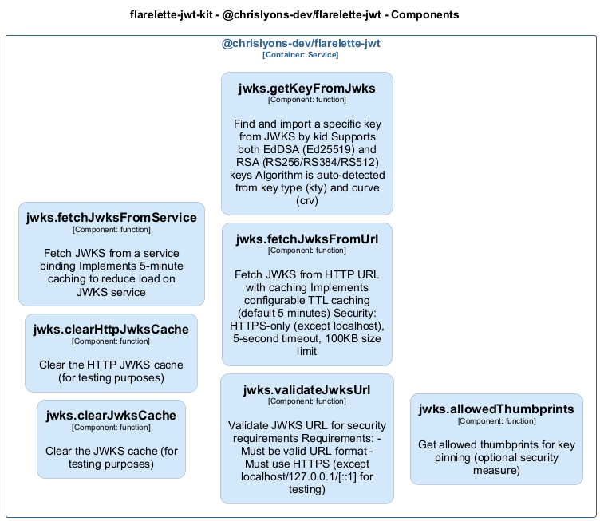

# jwks — Code View

[← Back to Container](./chrislyons_dev_flarelette_jwt.md) | [← Back to System](./README.md)

---

## Component Information

| Field | Value |
| --- | --- |
| **Component** | jwks |
| **Container** | @chrislyons-dev/flarelette-jwt |
| **Type** | `module` |
| **Description** | JSON Web Key Set (JWKS) utilities.  This module provides functions to fetch and manage JWKS, including caching and key lookup by key ID (kid). It supports integration with external JWKS services. |
---

## Code Structure

### Class Diagram

### Code Elements

<strong>7 code element(s)</strong>

#### Functions

##### `clearJwksCache()`

Clear the JWKS cache (for testing purposes)

| Field | Value |
| --- | --- |
| **Type** | `function` |
| **Visibility** | `public` |
| **Returns** | `void` || **Location** | `C:/Users/chris/git/flarelette-jwt-kit/packages/flarelette-jwt-ts/src/jwks.ts:49` |

---
##### `clearHttpJwksCache()`

Clear the HTTP JWKS cache (for testing purposes)

| Field | Value |
| --- | --- |
| **Type** | `function` |
| **Visibility** | `public` |
| **Returns** | `void` || **Location** | `C:/Users/chris/git/flarelette-jwt-kit/packages/flarelette-jwt-ts/src/jwks.ts:57` |

---
##### `fetchJwksFromService()`

Fetch JWKS from a service binding
Implements 5-minute caching to reduce load on JWKS service

| Field | Value |
| --- | --- |
| **Type** | `function` |
| **Visibility** | `public` |
| **Async** | Yes || **Returns** | `Promise<JWKWithKid[]>` || **Location** | `C:/Users/chris/git/flarelette-jwt-kit/packages/flarelette-jwt-ts/src/jwks.ts:65` |

**Parameters:**

- `service`: <code>import("C:/Users/chris/git/flarelette-jwt-kit/packages/flarelette-jwt-ts/src/types").Fetcher</code>

---
##### `validateJwksUrl()`

Validate JWKS URL for security requirements

Requirements:
- Must be valid URL format
- Must use HTTPS (except localhost/127.0.0.1/[::1] for testing)

| Field | Value |
| --- | --- |
| **Type** | `function` |
| **Visibility** | `private` |
| **Returns** | `URL` - Parsed URL object || **Location** | `C:/Users/chris/git/flarelette-jwt-kit/packages/flarelette-jwt-ts/src/jwks.ts:103` |

**Parameters:**

- `url`: <code>string</code> — - JWKS URL to validate

---
##### `fetchJwksFromUrl()`

Fetch JWKS from HTTP URL with caching

Implements configurable TTL caching (default 5 minutes)
Security: HTTPS-only (except localhost), 5-second timeout, 100KB size limit

| Field | Value |
| --- | --- |
| **Type** | `function` |
| **Visibility** | `public` |
| **Async** | Yes || **Returns** | `Promise<JWKWithKid[]>` - Array of JWK objects || **Location** | `C:/Users/chris/git/flarelette-jwt-kit/packages/flarelette-jwt-ts/src/jwks.ts:138` |

**Parameters:**

- `url`: <code>string</code> — - HTTP(S) URL to JWKS endpoint- `ttlSeconds`: <code>number</code> — - Cache TTL in seconds (default: 300)

---
##### `getKeyFromJwks()`

Find and import a specific key from JWKS by kid

Supports both EdDSA (Ed25519) and RSA (RS256/RS384/RS512) keys
Algorithm is auto-detected from key type (kty) and curve (crv)

| Field | Value |
| --- | --- |
| **Type** | `function` |
| **Visibility** | `public` |
| **Async** | Yes || **Returns** | `Promise<Uint8Array<ArrayBufferLike> \| CryptoKey>` - CryptoKey or Uint8Array suitable for jose verification || **Location** | `C:/Users/chris/git/flarelette-jwt-kit/packages/flarelette-jwt-ts/src/jwks.ts:211` |

**Parameters:**

- `kid`: <code>string</code> — - Key ID from JWT header- `jwks`: <code>JWKWithKid[]</code> — - Array of JWK objects

---
##### `allowedThumbprints()`

Get allowed thumbprints for key pinning (optional security measure)

| Field | Value |
| --- | --- |
| **Type** | `function` |
| **Visibility** | `public` |
| **Returns** | `Set<string>` || **Location** | `C:/Users/chris/git/flarelette-jwt-kit/packages/flarelette-jwt-ts/src/jwks.ts:244` |

---

---

<a href="./chrislyons_dev_flarelette_jwt.md">← Back to Container</a> | <a href="./README.md">← Back to System</a> | Generated with <a href="https://github.com/chrislyons-dev/archlette">Archlette</a>

