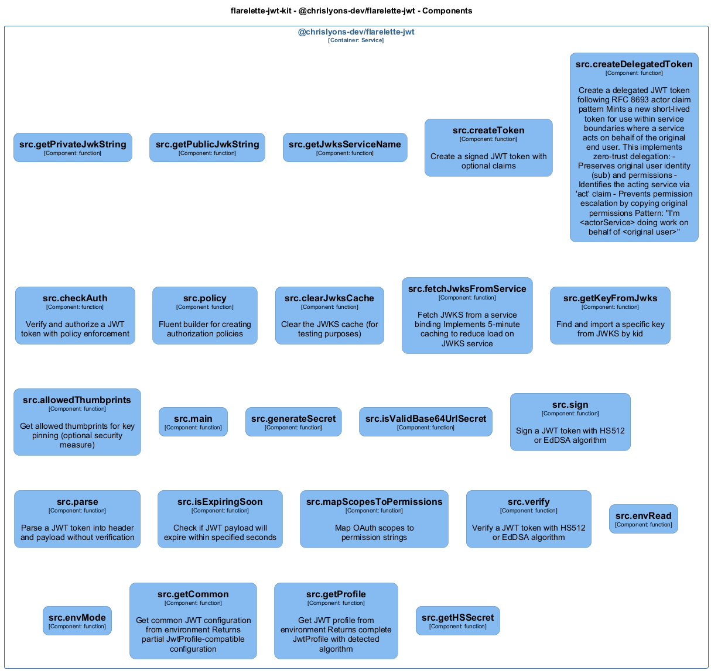

# src — Code View

[← Back to Container](./chrislyons_dev_flarelette_jwt.md) | [← Back to System](./README.md)

---

## Component Information

<table>
<tbody>
<tr>
<td><strong>Component</strong></td>
<td>src</td>
</tr>
<tr>
<td><strong>Container</strong></td>
<td>@chrislyons-dev/flarelette-jwt</td>
</tr>
<tr>
<td><strong>Type</strong></td>
<td><code>module</code></td>
</tr>
<tr>
<td><strong>Description</strong></td>
<td>Component inferred from directory: src</td>
</tr>
</tbody>
</table>

---

## Code Structure

### Class Diagram



### Code Elements

<details>
<summary><strong>24 code element(s)</strong></summary>


#### Functions

##### `envRead()`


<table>
<tbody>
<tr>
<td><strong>Type</strong></td>
<td><code>function</code></td>
</tr>
<tr>
<td><strong>Visibility</strong></td>
<td><code>private</code></td>
</tr>
<tr>
<td><strong>Returns</strong></td>
<td><code>string</code></td>
</tr>
<tr>
<td><strong>Location</strong></td>
<td><code>C:/users/chris/git/flarelette-jwt-kit/packages/flarelette-jwt-ts/src/config.ts:8</code></td>
</tr>
</tbody>
</table>

**Parameters:**

- `name`: <code>string</code>

---
##### `envMode()`


<table>
<tbody>
<tr>
<td><strong>Type</strong></td>
<td><code>function</code></td>
</tr>
<tr>
<td><strong>Visibility</strong></td>
<td><code>public</code></td>
</tr>
<tr>
<td><strong>Returns</strong></td>
<td><code>import("C:/users/chris/git/flarelette-jwt-kit/packages/flarelette-jwt-ts/src/types").AlgType</code></td>
</tr>
<tr>
<td><strong>Location</strong></td>
<td><code>C:/users/chris/git/flarelette-jwt-kit/packages/flarelette-jwt-ts/src/config.ts:18</code></td>
</tr>
</tbody>
</table>

**Parameters:**

- `role`: <code>"producer" | "consumer"</code>

---
##### `getCommon()`

Get common JWT configuration from environment
Returns partial JwtProfile-compatible configuration

<table>
<tbody>
<tr>
<td><strong>Type</strong></td>
<td><code>function</code></td>
</tr>
<tr>
<td><strong>Visibility</strong></td>
<td><code>public</code></td>
</tr>
<tr>
<td><strong>Returns</strong></td>
<td><code>{ iss: string; aud: string; leeway: number; ttlSeconds: number; }</code></td>
</tr>
<tr>
<td><strong>Location</strong></td>
<td><code>C:/users/chris/git/flarelette-jwt-kit/packages/flarelette-jwt-ts/src/config.ts:49</code></td>
</tr>
</tbody>
</table>


---
##### `getProfile()`

Get JWT profile from environment
Returns complete JwtProfile with detected algorithm

<table>
<tbody>
<tr>
<td><strong>Type</strong></td>
<td><code>function</code></td>
</tr>
<tr>
<td><strong>Visibility</strong></td>
<td><code>public</code></td>
</tr>
<tr>
<td><strong>Returns</strong></td>
<td><code>Partial<import("C:/users/chris/git/flarelette-jwt-kit/packages/flarelette-jwt-ts/src/types").JwtProfile> & { ttlSeconds: number; }</code></td>
</tr>
<tr>
<td><strong>Location</strong></td>
<td><code>C:/users/chris/git/flarelette-jwt-kit/packages/flarelette-jwt-ts/src/config.ts:62</code></td>
</tr>
</tbody>
</table>

**Parameters:**

- `role`: <code>"producer" | "consumer"</code>

---
##### `getHSSecret()`


<table>
<tbody>
<tr>
<td><strong>Type</strong></td>
<td><code>function</code></td>
</tr>
<tr>
<td><strong>Visibility</strong></td>
<td><code>public</code></td>
</tr>
<tr>
<td><strong>Returns</strong></td>
<td><code>Uint8Array<ArrayBufferLike></code></td>
</tr>
<tr>
<td><strong>Location</strong></td>
<td><code>C:/users/chris/git/flarelette-jwt-kit/packages/flarelette-jwt-ts/src/config.ts:77</code></td>
</tr>
</tbody>
</table>


---
##### `getPrivateJwkString()`


<table>
<tbody>
<tr>
<td><strong>Type</strong></td>
<td><code>function</code></td>
</tr>
<tr>
<td><strong>Visibility</strong></td>
<td><code>public</code></td>
</tr>
<tr>
<td><strong>Returns</strong></td>
<td><code>string</code></td>
</tr>
<tr>
<td><strong>Location</strong></td>
<td><code>C:/users/chris/git/flarelette-jwt-kit/packages/flarelette-jwt-ts/src/config.ts:104</code></td>
</tr>
</tbody>
</table>


---
##### `getPublicJwkString()`


<table>
<tbody>
<tr>
<td><strong>Type</strong></td>
<td><code>function</code></td>
</tr>
<tr>
<td><strong>Visibility</strong></td>
<td><code>public</code></td>
</tr>
<tr>
<td><strong>Returns</strong></td>
<td><code>string</code></td>
</tr>
<tr>
<td><strong>Location</strong></td>
<td><code>C:/users/chris/git/flarelette-jwt-kit/packages/flarelette-jwt-ts/src/config.ts:110</code></td>
</tr>
</tbody>
</table>


---
##### `getJwksServiceName()`


<table>
<tbody>
<tr>
<td><strong>Type</strong></td>
<td><code>function</code></td>
</tr>
<tr>
<td><strong>Visibility</strong></td>
<td><code>public</code></td>
</tr>
<tr>
<td><strong>Returns</strong></td>
<td><code>string</code></td>
</tr>
<tr>
<td><strong>Location</strong></td>
<td><code>C:/users/chris/git/flarelette-jwt-kit/packages/flarelette-jwt-ts/src/config.ts:116</code></td>
</tr>
</tbody>
</table>


---
##### `createToken()`

Create a signed JWT token with optional claims

<table>
<tbody>
<tr>
<td><strong>Type</strong></td>
<td><code>function</code></td>
</tr>
<tr>
<td><strong>Visibility</strong></td>
<td><code>public</code></td>
</tr>
<tr>
<td><strong>Async</strong></td>
<td>Yes</td>
</tr>
<tr>
<td><strong>Returns</strong></td>
<td><code>Promise<string></code> — Signed JWT token string</td>
</tr>
<tr>
<td><strong>Location</strong></td>
<td><code>C:/users/chris/git/flarelette-jwt-kit/packages/flarelette-jwt-ts/src/high.ts:13</code></td>
</tr>
</tbody>
</table>

**Parameters:**

- `claims`: <code>import("C:/users/chris/git/flarelette-jwt-kit/packages/flarelette-jwt-ts/src/types").ClaimsDict</code> — - Claims to include in the token (can include custom claims beyond standard JWT fields)- `opts`: <code>Partial<{ iss: string; aud: string | string[]; ttlSeconds: number; }></code> — - Optional overrides for iss, aud, ttlSeconds

---
##### `createDelegatedToken()`

Create a delegated JWT token following RFC 8693 actor claim pattern

Mints a new short-lived token for use within service boundaries where a service
acts on behalf of the original end user. This implements zero-trust delegation:
- Preserves original user identity (sub) and permissions
- Identifies the acting service via 'act' claim
- Prevents permission escalation by copying original permissions

Pattern: "I'm <actorService> doing work on behalf of <original user>"

<table>
<tbody>
<tr>
<td><strong>Type</strong></td>
<td><code>function</code></td>
</tr>
<tr>
<td><strong>Visibility</strong></td>
<td><code>public</code></td>
</tr>
<tr>
<td><strong>Async</strong></td>
<td>Yes</td>
</tr>
<tr>
<td><strong>Returns</strong></td>
<td><code>Promise<string></code> — Signed JWT token string with delegation claim</td>
</tr>
<tr>
<td><strong>Location</strong></td>
<td><code>C:/users/chris/git/flarelette-jwt-kit/packages/flarelette-jwt-ts/src/high.ts:56</code></td>
</tr>
</tbody>
</table>

**Parameters:**

- `originalPayload`: <code>import("C:/users/chris/git/flarelette-jwt-kit/packages/flarelette-jwt-ts/src/types").ClaimsDict</code> — - The verified JWT payload from external auth (e.g., Auth0)- `actorService`: <code>string</code> — - Identifier of the service creating this delegated token- `opts`: <code>Partial<{ iss: string; aud: string | string[]; ttlSeconds: number; }></code> — - Optional overrides for iss, aud, ttlSeconds
**Examples:**
```typescript

```

---
##### `checkAuth()`

Verify and authorize a JWT token with policy enforcement

<table>
<tbody>
<tr>
<td><strong>Type</strong></td>
<td><code>function</code></td>
</tr>
<tr>
<td><strong>Visibility</strong></td>
<td><code>public</code></td>
</tr>
<tr>
<td><strong>Async</strong></td>
<td>Yes</td>
</tr>
<tr>
<td><strong>Returns</strong></td>
<td><code>Promise<import("C:/users/chris/git/flarelette-jwt-kit/packages/flarelette-jwt-ts/src/high").AuthUser></code> — AuthUser if valid and authorized, null otherwise</td>
</tr>
<tr>
<td><strong>Location</strong></td>
<td><code>C:/users/chris/git/flarelette-jwt-kit/packages/flarelette-jwt-ts/src/high.ts:143</code></td>
</tr>
</tbody>
</table>

**Parameters:**

- `token`: <code>string</code> — - JWT token string to verify- `opts`: <code>import("C:/users/chris/git/flarelette-jwt-kit/packages/flarelette-jwt-ts/src/high").AuthzOpts</code> — - Authorization options including verification and policy requirements

---
##### `policy()`

Fluent builder for creating authorization policies

<table>
<tbody>
<tr>
<td><strong>Type</strong></td>
<td><code>function</code></td>
</tr>
<tr>
<td><strong>Visibility</strong></td>
<td><code>public</code></td>
</tr>
<tr>
<td><strong>Returns</strong></td>
<td><code>{ base(b: Partial<{ iss: string; aud: string | string[]; leeway: number; }>): any; needAll(...perms: string[]): any; needAny(...perms: string[]): any; rolesAll(...roles: string[]): any; rolesAny(...roles: string[]): any; where(fn: (payload: JWTPayload) => boolean): any; build(): import("C:/users/chris/git/flarelette-jwt-kit/packages/flarelette-jwt-ts/src/high").AuthzOpts; }</code> — Policy builder with chainable methods</td>
</tr>
<tr>
<td><strong>Location</strong></td>
<td><code>C:/users/chris/git/flarelette-jwt-kit/packages/flarelette-jwt-ts/src/high.ts:178</code></td>
</tr>
</tbody>
</table>


---
##### `clearJwksCache()`

Clear the JWKS cache (for testing purposes)

<table>
<tbody>
<tr>
<td><strong>Type</strong></td>
<td><code>function</code></td>
</tr>
<tr>
<td><strong>Visibility</strong></td>
<td><code>public</code></td>
</tr>
<tr>
<td><strong>Returns</strong></td>
<td><code>void</code></td>
</tr>
<tr>
<td><strong>Location</strong></td>
<td><code>C:/users/chris/git/flarelette-jwt-kit/packages/flarelette-jwt-ts/src/jwks.ts:27</code></td>
</tr>
</tbody>
</table>


---
##### `fetchJwksFromService()`

Fetch JWKS from a service binding
Implements 5-minute caching to reduce load on JWKS service

<table>
<tbody>
<tr>
<td><strong>Type</strong></td>
<td><code>function</code></td>
</tr>
<tr>
<td><strong>Visibility</strong></td>
<td><code>public</code></td>
</tr>
<tr>
<td><strong>Async</strong></td>
<td>Yes</td>
</tr>
<tr>
<td><strong>Returns</strong></td>
<td><code>Promise<JWKWithKid[]></code></td>
</tr>
<tr>
<td><strong>Location</strong></td>
<td><code>C:/users/chris/git/flarelette-jwt-kit/packages/flarelette-jwt-ts/src/jwks.ts:35</code></td>
</tr>
</tbody>
</table>

**Parameters:**

- `service`: <code>import("C:/users/chris/git/flarelette-jwt-kit/packages/flarelette-jwt-ts/src/types").Fetcher</code>

---
##### `getKeyFromJwks()`

Find and import a specific key from JWKS by kid

<table>
<tbody>
<tr>
<td><strong>Type</strong></td>
<td><code>function</code></td>
</tr>
<tr>
<td><strong>Visibility</strong></td>
<td><code>public</code></td>
</tr>
<tr>
<td><strong>Async</strong></td>
<td>Yes</td>
</tr>
<tr>
<td><strong>Returns</strong></td>
<td><code>Promise<Uint8Array<ArrayBufferLike> | CryptoKey></code></td>
</tr>
<tr>
<td><strong>Location</strong></td>
<td><code>C:/users/chris/git/flarelette-jwt-kit/packages/flarelette-jwt-ts/src/jwks.ts:65</code></td>
</tr>
</tbody>
</table>

**Parameters:**

- `kid`: <code>string</code>- `jwks`: <code>JWKWithKid[]</code>

---
##### `allowedThumbprints()`

Get allowed thumbprints for key pinning (optional security measure)

<table>
<tbody>
<tr>
<td><strong>Type</strong></td>
<td><code>function</code></td>
</tr>
<tr>
<td><strong>Visibility</strong></td>
<td><code>public</code></td>
</tr>
<tr>
<td><strong>Returns</strong></td>
<td><code>Set<string></code></td>
</tr>
<tr>
<td><strong>Location</strong></td>
<td><code>C:/users/chris/git/flarelette-jwt-kit/packages/flarelette-jwt-ts/src/jwks.ts:94</code></td>
</tr>
</tbody>
</table>


---
##### `main()`


<table>
<tbody>
<tr>
<td><strong>Type</strong></td>
<td><code>function</code></td>
</tr>
<tr>
<td><strong>Visibility</strong></td>
<td><code>private</code></td>
</tr>
<tr>
<td><strong>Async</strong></td>
<td>Yes</td>
</tr>
<tr>
<td><strong>Returns</strong></td>
<td><code>Promise<void></code></td>
</tr>
<tr>
<td><strong>Location</strong></td>
<td><code>C:/users/chris/git/flarelette-jwt-kit/packages/flarelette-jwt-ts/src/keygen.ts:5</code></td>
</tr>
</tbody>
</table>


---
##### `generateSecret()`


<table>
<tbody>
<tr>
<td><strong>Type</strong></td>
<td><code>function</code></td>
</tr>
<tr>
<td><strong>Visibility</strong></td>
<td><code>public</code></td>
</tr>
<tr>
<td><strong>Returns</strong></td>
<td><code>string</code></td>
</tr>
<tr>
<td><strong>Location</strong></td>
<td><code>C:/users/chris/git/flarelette-jwt-kit/packages/flarelette-jwt-ts/src/secret.ts:3</code></td>
</tr>
</tbody>
</table>

**Parameters:**

- `lengthBytes`: <code>number</code>

---
##### `isValidBase64UrlSecret()`


<table>
<tbody>
<tr>
<td><strong>Type</strong></td>
<td><code>function</code></td>
</tr>
<tr>
<td><strong>Visibility</strong></td>
<td><code>public</code></td>
</tr>
<tr>
<td><strong>Returns</strong></td>
<td><code>boolean</code></td>
</tr>
<tr>
<td><strong>Location</strong></td>
<td><code>C:/users/chris/git/flarelette-jwt-kit/packages/flarelette-jwt-ts/src/secret.ts:15</code></td>
</tr>
</tbody>
</table>

**Parameters:**

- `s`: <code>string</code>- `minBytes`: <code>number</code>

---
##### `sign()`

Sign a JWT token with HS512 or EdDSA algorithm

<table>
<tbody>
<tr>
<td><strong>Type</strong></td>
<td><code>function</code></td>
</tr>
<tr>
<td><strong>Visibility</strong></td>
<td><code>public</code></td>
</tr>
<tr>
<td><strong>Async</strong></td>
<td>Yes</td>
</tr>
<tr>
<td><strong>Returns</strong></td>
<td><code>Promise<string></code> — Signed JWT token string</td>
</tr>
<tr>
<td><strong>Location</strong></td>
<td><code>C:/users/chris/git/flarelette-jwt-kit/packages/flarelette-jwt-ts/src/sign.ts:12</code></td>
</tr>
</tbody>
</table>

**Parameters:**

- `payload`: <code>import("C:/users/chris/git/flarelette-jwt-kit/packages/flarelette-jwt-ts/src/types").ClaimsDict</code> — - Claims to include in the token (can include custom claims beyond standard JWT fields)- `opts`: <code>Partial<{ iss: string; aud: string | string[]; ttlSeconds: number; }></code> — - Optional overrides for iss, aud, ttlSeconds

---
##### `parse()`

Parse a JWT token into header and payload without verification

<table>
<tbody>
<tr>
<td><strong>Type</strong></td>
<td><code>function</code></td>
</tr>
<tr>
<td><strong>Visibility</strong></td>
<td><code>public</code></td>
</tr>
<tr>
<td><strong>Returns</strong></td>
<td><code>import("C:/users/chris/git/flarelette-jwt-kit/packages/flarelette-jwt-ts/src/types").ParsedJwt</code> — Parsed header and payload</td>
</tr>
<tr>
<td><strong>Location</strong></td>
<td><code>C:/users/chris/git/flarelette-jwt-kit/packages/flarelette-jwt-ts/src/util.ts:9</code></td>
</tr>
</tbody>
</table>

**Parameters:**

- `token`: <code>string</code> — - JWT token string

---
##### `isExpiringSoon()`

Check if JWT payload will expire within specified seconds

<table>
<tbody>
<tr>
<td><strong>Type</strong></td>
<td><code>function</code></td>
</tr>
<tr>
<td><strong>Visibility</strong></td>
<td><code>public</code></td>
</tr>
<tr>
<td><strong>Returns</strong></td>
<td><code>boolean</code> — True if token expires within the threshold</td>
</tr>
<tr>
<td><strong>Location</strong></td>
<td><code>C:/users/chris/git/flarelette-jwt-kit/packages/flarelette-jwt-ts/src/util.ts:25</code></td>
</tr>
</tbody>
</table>

**Parameters:**

- `payload`: <code>import("C:/users/chris/git/flarelette-jwt-kit/packages/flarelette-jwt-ts/src/types").JwtPayload</code> — - JWT payload with 'exp' claim- `seconds`: <code>number</code> — - Number of seconds threshold

---
##### `mapScopesToPermissions()`

Map OAuth scopes to permission strings

<table>
<tbody>
<tr>
<td><strong>Type</strong></td>
<td><code>function</code></td>
</tr>
<tr>
<td><strong>Visibility</strong></td>
<td><code>public</code></td>
</tr>
<tr>
<td><strong>Returns</strong></td>
<td><code>string[]</code> — List of permission strings (currently identity mapping)</td>
</tr>
<tr>
<td><strong>Location</strong></td>
<td><code>C:/users/chris/git/flarelette-jwt-kit/packages/flarelette-jwt-ts/src/util.ts:37</code></td>
</tr>
</tbody>
</table>

**Parameters:**

- `scopes`: <code>string[]</code> — - List of OAuth scope strings

---
##### `verify()`

Verify a JWT token with HS512 or EdDSA algorithm

<table>
<tbody>
<tr>
<td><strong>Type</strong></td>
<td><code>function</code></td>
</tr>
<tr>
<td><strong>Visibility</strong></td>
<td><code>public</code></td>
</tr>
<tr>
<td><strong>Async</strong></td>
<td>Yes</td>
</tr>
<tr>
<td><strong>Returns</strong></td>
<td><code>Promise<any></code> — Decoded payload if valid, null otherwise</td>
</tr>
<tr>
<td><strong>Location</strong></td>
<td><code>C:/users/chris/git/flarelette-jwt-kit/packages/flarelette-jwt-ts/src/verify.ts:19</code></td>
</tr>
</tbody>
</table>

**Parameters:**

- `token`: <code>string</code> — - JWT token string to verify- `opts`: <code>Partial<{ iss: string; aud: string | string[]; leeway: number; jwksService: import("C:/users/chris/git/flarelette-jwt-kit/packages/flarelette-jwt-ts/src/types").Fetcher; }></code> — - Optional overrides for iss, aud, leeway, and jwksService

---

</details>

---

<div align="center">
<sub><a href="./chrislyons_dev_flarelette_jwt.md">← Back to Container</a> | <a href="./README.md">← Back to System</a> | Generated with <a href="https://github.com/chrislyons-dev/archlette">Archlette</a></sub>
</div>
