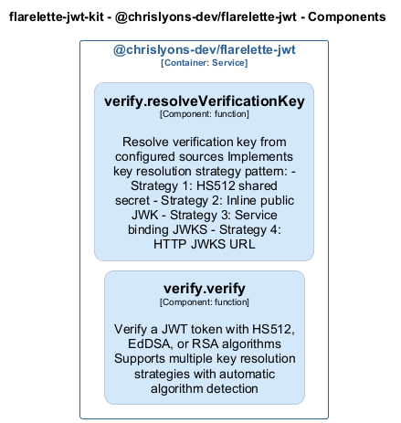

# verify — Code View

[← Back to Container](./chrislyons_dev_flarelette_jwt.md) | [← Back to System](./README.md)

---

## Component Information

| Field | Value |
| --- | --- |
| **Component** | verify |
| **Container** | @chrislyons-dev/flarelette-jwt |
| **Type** | `module` |
| **Description** | JWT verification utilities.  This module provides functions to verify JWT tokens using either HS512 or EdDSA algorithms. It supports integration with JWKS services and thumbprint pinning. |
---

## Code Structure

### Class Diagram

### Code Elements

<strong>2 code element(s)</strong>

#### Functions

##### `resolveVerificationKey()`

Resolve verification key from configured sources

Implements key resolution strategy pattern:
- Strategy 1: HS512 shared secret
- Strategy 2: Inline public JWK
- Strategy 3: Service binding JWKS
- Strategy 4: HTTP JWKS URL

| Field | Value |
| --- | --- |
| **Type** | `function` |
| **Visibility** | `private` |
| **Async** | Yes || **Returns** | `Promise<{ key: Uint8Array<ArrayBufferLike> \| CryptoKey; algorithms: string[]; }>` - Key and allowed algorithms || **Location** | `C:/Users/chris/git/flarelette-jwt-kit/packages/flarelette-jwt-ts/src/verify.ts:47` |

**Parameters:**

- `token`: <code>string</code> — - JWT token string- `opts`: <code>Partial<{ jwksService: import("C:/Users/chris/git/flarelette-jwt-kit/packages/flarelette-jwt-ts/src/types").Fetcher; jwksUrl: string; jwksCacheTtl: number; }></code> — - Verification options

---
##### `verify()`

Verify a JWT token with HS512, EdDSA, or RSA algorithms

Supports multiple key resolution strategies with automatic algorithm detection

| Field | Value |
| --- | --- |
| **Type** | `function` |
| **Visibility** | `public` |
| **Async** | Yes || **Returns** | `Promise<import("C:/Users/chris/git/flarelette-jwt-kit/packages/flarelette-jwt-ts/src/types").JwtPayload>` - Decoded payload if valid, null otherwise || **Location** | `C:/Users/chris/git/flarelette-jwt-kit/packages/flarelette-jwt-ts/src/verify.ts:131` |

**Parameters:**

- `token`: <code>string</code> — - JWT token string to verify- `opts`: <code>Partial<{ iss: string; aud: string | string[]; leeway: number; jwksService: import("C:/Users/chris/git/flarelette-jwt-kit/packages/flarelette-jwt-ts/src/types").Fetcher; jwksUrl: string; jwksCacheTtl: number; }></code> — - Optional overrides for iss, aud, leeway, jwksService, jwksUrl, jwksCacheTtl

---

---

<a href="./chrislyons_dev_flarelette_jwt.md">← Back to Container</a> | <a href="./README.md">← Back to System</a> | Generated with <a href="https://github.com/chrislyons-dev/archlette">Archlette</a>

