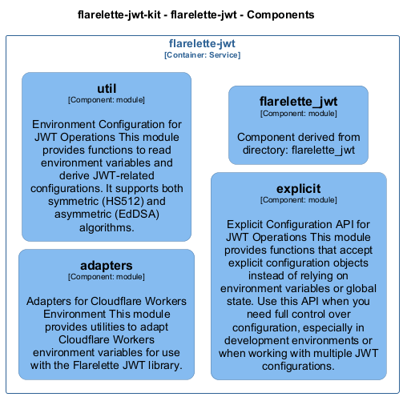

# flarelette-jwt

[← Back to System Overview](./README.md)

---

## Container Context

---

## Container Information

| Field | Value |
| --- | --- |
| **Name** | flarelette-jwt |
| **Type** | `Service` |
| **Description** | Python implementation of the Flarelette JWT Kit: An environment-driven JWT authentication package for Cloudflare Workers || **Tags** | `Auto-generated` |
---

## Components

### Component View

### Component Details

| Component | Type | Description | Code |
| --- | --- | --- | --- |
| **adapters** | `module` | Adapters for Cloudflare Workers Environment  This module provides utilities to adapt Cloudflare Workers environment variables for use with the Flarelette JWT library. | [View](./flarelette_jwt__adapters.md) |
| **util** | `module` | Environment Configuration for JWT Operations  This module provides functions to read environment variables and derive JWT-related configurations. It supports both symmetric (HS512) and asymmetric (EdDSA) algorithms. | [View](./flarelette_jwt__util.md) |
| **explicit** | `module` | Explicit Configuration API for JWT Operations  This module provides functions that accept explicit configuration objects instead of relying on environment variables or global state. Use this API when you need full control over configuration, especially in development environments or when working with multiple JWT configurations. | [View](./flarelette_jwt__explicit.md) |
| **flarelette_jwt** | `module` | Component derived from directory: flarelette_jwt | [View](./flarelette_jwt__flarelette_jwt.md) |

---

<a href="./README.md">← Back to System Overview</a> | Generated with <a href="https://github.com/chrislyons-dev/archlette">Archlette</a>

