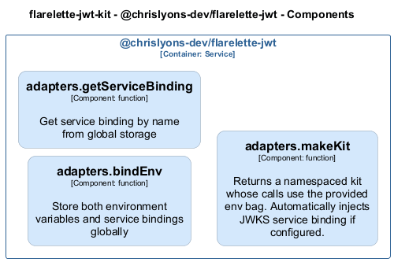
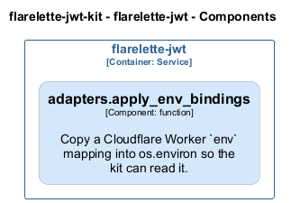

# adapters — Code View

[← Back to Container](./flarelette_jwt.md) | [← Back to System](./README.md)

---

## Component Information

| Field | Value |
| --- | --- |
| **Component** | adapters |
| **Container** | flarelette-jwt |
| **Type** | `module` |
| **Description** | Adapters for Cloudflare Workers Environment  This module provides utilities to adapt Cloudflare Workers environment variables for use with the Flarelette JWT library. |
---

## Code Structure

### Class Diagram

### Code Elements

<strong>1 code element(s)</strong>

#### Functions

##### `apply_env_bindings()`

Copy a Cloudflare Worker `env` mapping into os.environ so the kit can read it.

| Field | Value |
| --- | --- |
| **Type** | `function` |
| **Visibility** | `-` |
| **Returns** | `None` || **Location** | `C:\Users\chris\git\flarelette-jwt-kit\packages\flarelette-jwt-py\flarelette_jwt\adapters.py:15` |

**Parameters:**

- `env`: <code>Mapping[str, str]</code>

---

---

<a href="./flarelette_jwt.md">← Back to Container</a> | <a href="./README.md">← Back to System</a> | Generated with <a href="https://github.com/chrislyons-dev/archlette">Archlette</a>

