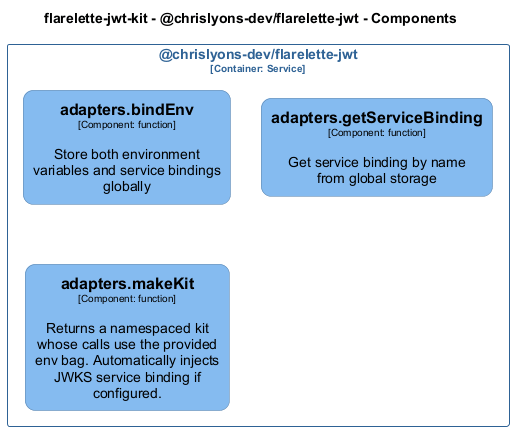
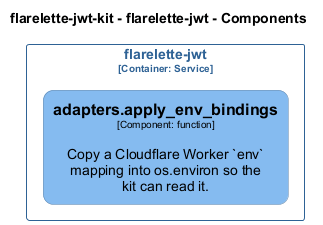

# adapters — Code View

[← Back to Container](./flarelette_jwt.md) | [← Back to System](./README.md)

---

## Component Information

<table>
<tbody>
<tr>
<td><strong>Component</strong></td>
<td>adapters</td>
</tr>
<tr>
<td><strong>Container</strong></td>
<td>flarelette-jwt</td>
</tr>
<tr>
<td><strong>Type</strong></td>
<td><code>module</code></td>
</tr>
<tr>
<td><strong>Description</strong></td>
<td>Adapters for Cloudflare Workers Environment

This module provides utilities to adapt Cloudflare Workers environment variables
for use with the Flarelette JWT library.</td>
</tr>
</tbody>
</table>

---

## Code Structure

### Class Diagram

### Code Elements

<strong>1 code element(s)</strong>

#### Functions

##### `apply_env_bindings()`

Copy a Cloudflare Worker `env` mapping into os.environ so the kit can read it.

<table>
<tbody>
<tr>
<td><strong>Type</strong></td>
<td><code>function</code></td>
</tr>
<tr>
<td><strong>Visibility</strong></td>
<td><code></code></td>
</tr>
<tr>
<td><strong>Returns</strong></td>
<td><code>None</code></td>
</tr>
<tr>
<td><strong>Location</strong></td>
<td><code>C:\Users\chris\git\flarelette-jwt-kit\packages\flarelette-jwt-py\flarelette_jwt\adapters.py:15</code></td>
</tr>
</tbody>
</table>

**Parameters:**

- `env`: <code>Mapping[str, str]</code>

---

---

<a href="./flarelette_jwt.md">← Back to Container</a> | <a href="./README.md">← Back to System</a> | Generated with <a href="https://github.com/chrislyons-dev/archlette">Archlette</a>

