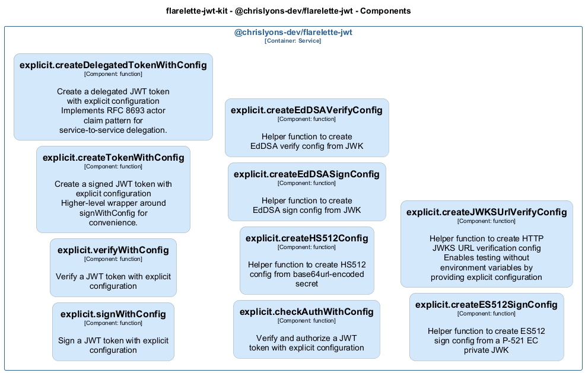
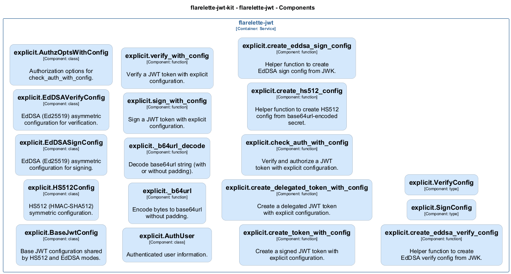

# explicit — Code View

[← Back to Container](./flarelette_jwt.md) | [← Back to System](./README.md)

---

## Component Information

<table>
<tbody>
<tr>
<td><strong>Component</strong></td>
<td>explicit</td>
</tr>
<tr>
<td><strong>Container</strong></td>
<td>flarelette-jwt</td>
</tr>
<tr>
<td><strong>Type</strong></td>
<td><code>module</code></td>
</tr>
<tr>
<td><strong>Description</strong></td>
<td>Explicit Configuration API for JWT Operations

This module provides functions that accept explicit configuration objects
instead of relying on environment variables or global state. Use this API
when you need full control over configuration, especially in development
environments or when working with multiple JWT configurations.</td>
</tr>
</tbody>
</table>

---

## Code Structure

### Class Diagram




### Code Elements

<details>
<summary><strong>18 code element(s)</strong></summary>


#### Classes

##### `BaseJwtConfig`

Base JWT configuration shared by HS512 and EdDSA modes.

<table>
<tbody>
<tr>
<td><strong>Type</strong></td>
<td><code>class</code></td>
</tr>
<tr>
<td><strong>Visibility</strong></td>
<td><code></code></td>
</tr>
<tr>
<td><strong>Location</strong></td>
<td><code>C:\Users\chris\git\flarelette-jwt-kit\packages\flarelette-jwt-py\flarelette_jwt\explicit.py:25</code></td>
</tr>
</tbody>
</table>


---
##### `HS512Config`

HS512 (HMAC-SHA512) symmetric configuration.

<table>
<tbody>
<tr>
<td><strong>Type</strong></td>
<td><code>class</code></td>
</tr>
<tr>
<td><strong>Visibility</strong></td>
<td><code></code></td>
</tr>
<tr>
<td><strong>Location</strong></td>
<td><code>C:\Users\chris\git\flarelette-jwt-kit\packages\flarelette-jwt-py\flarelette_jwt\explicit.py:41</code></td>
</tr>
</tbody>
</table>


---
##### `EdDSASignConfig`

EdDSA (Ed25519) asymmetric configuration for signing.

<table>
<tbody>
<tr>
<td><strong>Type</strong></td>
<td><code>class</code></td>
</tr>
<tr>
<td><strong>Visibility</strong></td>
<td><code></code></td>
</tr>
<tr>
<td><strong>Location</strong></td>
<td><code>C:\Users\chris\git\flarelette-jwt-kit\packages\flarelette-jwt-py\flarelette_jwt\explicit.py:55</code></td>
</tr>
</tbody>
</table>


---
##### `EdDSAVerifyConfig`

EdDSA (Ed25519) asymmetric configuration for verification.

<table>
<tbody>
<tr>
<td><strong>Type</strong></td>
<td><code>class</code></td>
</tr>
<tr>
<td><strong>Visibility</strong></td>
<td><code></code></td>
</tr>
<tr>
<td><strong>Location</strong></td>
<td><code>C:\Users\chris\git\flarelette-jwt-kit\packages\flarelette-jwt-py\flarelette_jwt\explicit.py:71</code></td>
</tr>
</tbody>
</table>


---
##### `AuthzOptsWithConfig`

Authorization options for check_auth_with_config.

<table>
<tbody>
<tr>
<td><strong>Type</strong></td>
<td><code>class</code></td>
</tr>
<tr>
<td><strong>Visibility</strong></td>
<td><code></code></td>
</tr>
<tr>
<td><strong>Location</strong></td>
<td><code>C:\Users\chris\git\flarelette-jwt-kit\packages\flarelette-jwt-py\flarelette_jwt\explicit.py:399</code></td>
</tr>
</tbody>
</table>


---
##### `AuthUser`

Authenticated user information.

<table>
<tbody>
<tr>
<td><strong>Type</strong></td>
<td><code>class</code></td>
</tr>
<tr>
<td><strong>Visibility</strong></td>
<td><code></code></td>
</tr>
<tr>
<td><strong>Location</strong></td>
<td><code>C:\Users\chris\git\flarelette-jwt-kit\packages\flarelette-jwt-py\flarelette_jwt\explicit.py:417</code></td>
</tr>
</tbody>
</table>


---

#### Functions

##### `_b64url()`

Encode bytes to base64url without padding.

<table>
<tbody>
<tr>
<td><strong>Type</strong></td>
<td><code>function</code></td>
</tr>
<tr>
<td><strong>Visibility</strong></td>
<td><code></code></td>
</tr>
<tr>
<td><strong>Returns</strong></td>
<td><code>str</code></td>
</tr>
<tr>
<td><strong>Location</strong></td>
<td><code>C:\Users\chris\git\flarelette-jwt-kit\packages\flarelette-jwt-py\flarelette_jwt\explicit.py:90</code></td>
</tr>
</tbody>
</table>

**Parameters:**

- `b`: <code>bytes</code>

---
##### `_b64url_decode()`

Decode base64url string (with or without padding).

<table>
<tbody>
<tr>
<td><strong>Type</strong></td>
<td><code>function</code></td>
</tr>
<tr>
<td><strong>Visibility</strong></td>
<td><code></code></td>
</tr>
<tr>
<td><strong>Returns</strong></td>
<td><code>bytes</code></td>
</tr>
<tr>
<td><strong>Location</strong></td>
<td><code>C:\Users\chris\git\flarelette-jwt-kit\packages\flarelette-jwt-py\flarelette_jwt\explicit.py:95</code></td>
</tr>
</tbody>
</table>

**Parameters:**

- `s`: <code>str</code>

---
##### `sign_with_config()`

Sign a JWT token with explicit configuration.

<table>
<tbody>
<tr>
<td><strong>Type</strong></td>
<td><code>function</code></td>
</tr>
<tr>
<td><strong>Visibility</strong></td>
<td><code></code></td>
</tr>
<tr>
<td><strong>Async</strong></td>
<td>Yes</td>
</tr>
<tr>
<td><strong>Returns</strong></td>
<td><code>str</code> — Signed JWT token string</td>
</tr>
<tr>
<td><strong>Location</strong></td>
<td><code>C:\Users\chris\git\flarelette-jwt-kit\packages\flarelette-jwt-py\flarelette_jwt\explicit.py:100</code></td>
</tr>
</tbody>
</table>

**Parameters:**

- `payload`: <code>JwtPayload</code> — Claims to include in the token- `config`: <code>SignConfig</code> — Explicit JWT configuration
**Examples:**
```typescript

```

---
##### `verify_with_config()`

Verify a JWT token with explicit configuration.

<table>
<tbody>
<tr>
<td><strong>Type</strong></td>
<td><code>function</code></td>
</tr>
<tr>
<td><strong>Visibility</strong></td>
<td><code></code></td>
</tr>
<tr>
<td><strong>Async</strong></td>
<td>Yes</td>
</tr>
<tr>
<td><strong>Returns</strong></td>
<td><code>JwtPayload | None</code> — Payload if valid, None if invalid</td>
</tr>
<tr>
<td><strong>Location</strong></td>
<td><code>C:\Users\chris\git\flarelette-jwt-kit\packages\flarelette-jwt-py\flarelette_jwt\explicit.py:187</code></td>
</tr>
</tbody>
</table>

**Parameters:**

- `token`: <code>str</code> — JWT token string to verify- `config`: <code>VerifyConfig</code> — Explicit JWT configuration
**Examples:**
```typescript

```

---
##### `create_token_with_config()`

Create a signed JWT token with explicit configuration.

<table>
<tbody>
<tr>
<td><strong>Type</strong></td>
<td><code>function</code></td>
</tr>
<tr>
<td><strong>Visibility</strong></td>
<td><code></code></td>
</tr>
<tr>
<td><strong>Async</strong></td>
<td>Yes</td>
</tr>
<tr>
<td><strong>Returns</strong></td>
<td><code>str</code> — Signed JWT token string</td>
</tr>
<tr>
<td><strong>Location</strong></td>
<td><code>C:\Users\chris\git\flarelette-jwt-kit\packages\flarelette-jwt-py\flarelette_jwt\explicit.py:296</code></td>
</tr>
</tbody>
</table>

**Parameters:**

- `claims`: <code>JwtPayload</code> — Claims to include in the token- `config`: <code>SignConfig</code> — Explicit JWT configuration

---
##### `create_delegated_token_with_config()`

Create a delegated JWT token with explicit configuration.

<table>
<tbody>
<tr>
<td><strong>Type</strong></td>
<td><code>function</code></td>
</tr>
<tr>
<td><strong>Visibility</strong></td>
<td><code></code></td>
</tr>
<tr>
<td><strong>Async</strong></td>
<td>Yes</td>
</tr>
<tr>
<td><strong>Returns</strong></td>
<td><code>str</code> — Signed JWT token string with delegation claim</td>
</tr>
<tr>
<td><strong>Location</strong></td>
<td><code>C:\Users\chris\git\flarelette-jwt-kit\packages\flarelette-jwt-py\flarelette_jwt\explicit.py:323</code></td>
</tr>
</tbody>
</table>

**Parameters:**

- `original_payload`: <code>JwtPayload</code> — The verified JWT payload from external auth- `actor_service`: <code>str</code> — Identifier of the service creating this delegated token- `config`: <code>SignConfig</code> — Explicit JWT configuration
**Examples:**
```typescript

```

---
##### `check_auth_with_config()`

Verify and authorize a JWT token with explicit configuration.

<table>
<tbody>
<tr>
<td><strong>Type</strong></td>
<td><code>function</code></td>
</tr>
<tr>
<td><strong>Visibility</strong></td>
<td><code></code></td>
</tr>
<tr>
<td><strong>Async</strong></td>
<td>Yes</td>
</tr>
<tr>
<td><strong>Returns</strong></td>
<td><code>AuthUser | None</code> — AuthUser if valid and authorized, None otherwise</td>
</tr>
<tr>
<td><strong>Location</strong></td>
<td><code>C:\Users\chris\git\flarelette-jwt-kit\packages\flarelette-jwt-py\flarelette_jwt\explicit.py:437</code></td>
</tr>
</tbody>
</table>

**Parameters:**

- `token`: <code>str</code> — JWT token string to verify- `config`: <code>VerifyConfig</code> — Explicit JWT configuration- `authz_opts`: <code>AuthzOptsWithConfig | None</code> — Authorization policy requirements
**Examples:**
```typescript

```

---
##### `create_hs512_config()`

Helper function to create HS512 config from base64url-encoded secret.

<table>
<tbody>
<tr>
<td><strong>Type</strong></td>
<td><code>function</code></td>
</tr>
<tr>
<td><strong>Visibility</strong></td>
<td><code></code></td>
</tr>
<tr>
<td><strong>Returns</strong></td>
<td><code>HS512Config</code> — HS512Config</td>
</tr>
<tr>
<td><strong>Location</strong></td>
<td><code>C:\Users\chris\git\flarelette-jwt-kit\packages\flarelette-jwt-py\flarelette_jwt\explicit.py:519</code></td>
</tr>
</tbody>
</table>

**Parameters:**

- `secret`: <code>str | bytes</code> — Base64url-encoded secret string or raw bytes (minimum 32 bytes)

---
##### `create_eddsa_sign_config()`

Helper function to create EdDSA sign config from JWK.

<table>
<tbody>
<tr>
<td><strong>Type</strong></td>
<td><code>function</code></td>
</tr>
<tr>
<td><strong>Visibility</strong></td>
<td><code></code></td>
</tr>
<tr>
<td><strong>Returns</strong></td>
<td><code>EdDSASignConfig</code> — EdDSASignConfig</td>
</tr>
<tr>
<td><strong>Location</strong></td>
<td><code>C:\Users\chris\git\flarelette-jwt-kit\packages\flarelette-jwt-py\flarelette_jwt\explicit.py:561</code></td>
</tr>
</tbody>
</table>

**Parameters:**

- `private_jwk`: <code>dict[str, Any] | str</code> — Private JWK dictionary or JSON string

---
##### `create_eddsa_verify_config()`

Helper function to create EdDSA verify config from JWK.

<table>
<tbody>
<tr>
<td><strong>Type</strong></td>
<td><code>function</code></td>
</tr>
<tr>
<td><strong>Visibility</strong></td>
<td><code></code></td>
</tr>
<tr>
<td><strong>Returns</strong></td>
<td><code>EdDSAVerifyConfig</code> — EdDSAVerifyConfig</td>
</tr>
<tr>
<td><strong>Location</strong></td>
<td><code>C:\Users\chris\git\flarelette-jwt-kit\packages\flarelette-jwt-py\flarelette_jwt\explicit.py:596</code></td>
</tr>
</tbody>
</table>

**Parameters:**

- `public_jwk`: <code>dict[str, Any] | str</code> — Public JWK dictionary or JSON string

---

</details>

---

<div align="center">
<sub><a href="./flarelette_jwt.md">← Back to Container</a> | <a href="./README.md">← Back to System</a> | Generated with <a href="https://github.com/chrislyons-dev/archlette">Archlette</a></sub>
</div>
