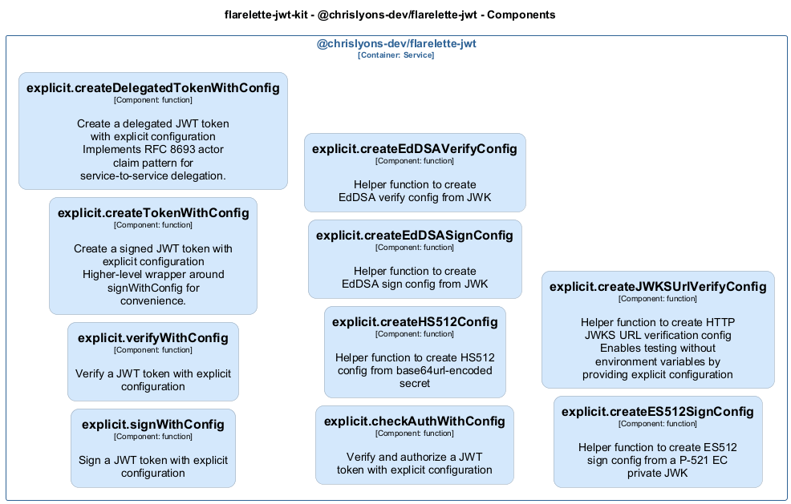
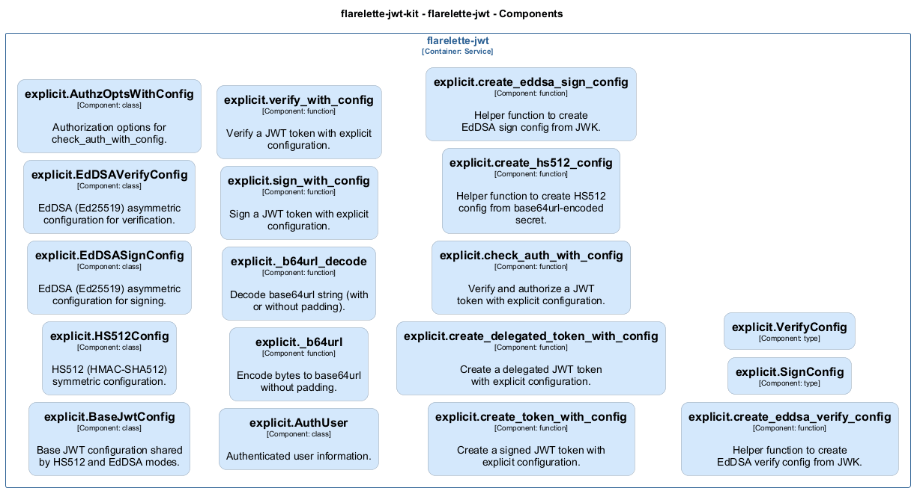

# explicit — Code View

[← Back to Container](./flarelette_jwt.md) | [← Back to System](./README.md)

---

## Component Information

| Field | Value |
| --- | --- |
| **Component** | explicit |
| **Container** | flarelette-jwt |
| **Type** | `module` |
| **Description** | Explicit Configuration API for JWT Operations<br><br>This module provides functions that accept explicit configuration objects<br>instead of relying on environment variables or global state. Use this API<br>when you need full control over configuration, especially in development<br>environments or when working with multiple JWT configurations. |
---

## Code Structure

### Class Diagram




### Code Elements

<details>
<summary><strong>31 code element(s)</strong></summary>


#### Classes

##### `BaseJwtConfig`

Base JWT configuration shared by HS512 and EdDSA modes.

| Field | Value |
| --- | --- |
| **Type** | `class` |
| **Visibility** | `-` |
| **Location** | `C:\Users\chris\git\flarelette-jwt-kit\packages\flarelette-jwt-py\flarelette_jwt\explicit.py:27` |


---
##### `HS512Config`

HS512 (HMAC-SHA512) symmetric configuration.

| Field | Value |
| --- | --- |
| **Type** | `class` |
| **Visibility** | `-` |
| **Location** | `C:\Users\chris\git\flarelette-jwt-kit\packages\flarelette-jwt-py\flarelette_jwt\explicit.py:43` |


---
##### `EdDSASignConfig`

EdDSA (Ed25519) asymmetric configuration for signing.

| Field | Value |
| --- | --- |
| **Type** | `class` |
| **Visibility** | `-` |
| **Location** | `C:\Users\chris\git\flarelette-jwt-kit\packages\flarelette-jwt-py\flarelette_jwt\explicit.py:57` |


---
##### `EdDSAVerifyConfig`

EdDSA (Ed25519) asymmetric configuration for verification.

| Field | Value |
| --- | --- |
| **Type** | `class` |
| **Visibility** | `-` |
| **Location** | `C:\Users\chris\git\flarelette-jwt-kit\packages\flarelette-jwt-py\flarelette_jwt\explicit.py:73` |


---
##### `ES512VerifyConfig`

ES512 (ECDSA P-521) asymmetric configuration for verification.

| Field | Value |
| --- | --- |
| **Type** | `class` |
| **Visibility** | `-` |
| **Location** | `C:\Users\chris\git\flarelette-jwt-kit\packages\flarelette-jwt-py\flarelette_jwt\explicit.py:87` |


---
##### `JWKSUrlVerifyConfig`

Asymmetric verification configuration backed by a remote JWKS URL.

| Field | Value |
| --- | --- |
| **Type** | `class` |
| **Visibility** | `-` |
| **Location** | `C:\Users\chris\git\flarelette-jwt-kit\packages\flarelette-jwt-py\flarelette_jwt\explicit.py:94` |


---
##### `AuthzOptsWithConfig`

Authorization options for check_auth_with_config.

| Field | Value |
| --- | --- |
| **Type** | `class` |
| **Visibility** | `-` |
| **Location** | `C:\Users\chris\git\flarelette-jwt-kit\packages\flarelette-jwt-py\flarelette_jwt\explicit.py:582` |


---
##### `AuthUser`

Authenticated user information.

| Field | Value |
| --- | --- |
| **Type** | `class` |
| **Visibility** | `-` |
| **Location** | `C:\Users\chris\git\flarelette-jwt-kit\packages\flarelette-jwt-py\flarelette_jwt\explicit.py:600` |


---

#### Functions

##### `_b64url()`

Encode bytes to base64url without padding.

| Field | Value |
| --- | --- |
| **Type** | `function` |
| **Visibility** | `-` |
| **Returns** | `str` || **Location** | `C:\Users\chris\git\flarelette-jwt-kit\packages\flarelette-jwt-py\flarelette_jwt\explicit.py:117` |

**Parameters:**

- `b`: <code>bytes</code>

---
##### `_b64url_decode()`

Decode base64url string (with or without padding).

| Field | Value |
| --- | --- |
| **Type** | `function` |
| **Visibility** | `-` |
| **Returns** | `bytes` || **Location** | `C:\Users\chris\git\flarelette-jwt-kit\packages\flarelette-jwt-py\flarelette_jwt\explicit.py:122` |

**Parameters:**

- `s`: <code>str</code>

---
##### `_validate_jwks_url()`


| Field | Value |
| --- | --- |
| **Type** | `function` |
| **Visibility** | `-` |
| **Returns** | `None` || **Location** | `C:\Users\chris\git\flarelette-jwt-kit\packages\flarelette-jwt-py\flarelette_jwt\explicit.py:127` |

**Parameters:**

- `url`: <code>str</code>

---
##### `_ecdsa_curve_name()`


| Field | Value |
| --- | --- |
| **Type** | `function` |
| **Visibility** | `-` |
| **Returns** | `str` || **Location** | `C:\Users\chris\git\flarelette-jwt-kit\packages\flarelette-jwt-py\flarelette_jwt\explicit.py:138` |

**Parameters:**

- `alg`: <code>str</code>

---
##### `_hash_name()`


| Field | Value |
| --- | --- |
| **Type** | `function` |
| **Visibility** | `-` |
| **Returns** | `str` || **Location** | `C:\Users\chris\git\flarelette-jwt-kit\packages\flarelette-jwt-py\flarelette_jwt\explicit.py:147` |

**Parameters:**

- `alg`: <code>str</code>

---
##### `_fetch_jwks_from_url()`


| Field | Value |
| --- | --- |
| **Type** | `function` |
| **Visibility** | `-` |
| **Async** | Yes || **Returns** | `list[dict[str, Any]]` || **Location** | `C:\Users\chris\git\flarelette-jwt-kit\packages\flarelette-jwt-py\flarelette_jwt\explicit.py:159` |

**Parameters:**

- `url`: <code>str</code>

---
##### `_find_jwk_by_kid()`


| Field | Value |
| --- | --- |
| **Type** | `function` |
| **Visibility** | `-` |
| **Returns** | `dict[str, Any] \| None` || **Location** | `C:\Users\chris\git\flarelette-jwt-kit\packages\flarelette-jwt-py\flarelette_jwt\explicit.py:189` |

**Parameters:**

- `kid`: <code>str | None</code>- `jwks`: <code>list[dict[str, Any]]</code>

---
##### `_import_verify_key()`


| Field | Value |
| --- | --- |
| **Type** | `function` |
| **Visibility** | `-` |
| **Async** | Yes || **Returns** | `tuple[Any, dict[str, str]]` || **Location** | `C:\Users\chris\git\flarelette-jwt-kit\packages\flarelette-jwt-py\flarelette_jwt\explicit.py:200` |

**Parameters:**

- `alg`: <code>str</code>- `jwk`: <code>dict[str, Any]</code>

---
##### `_has_public_jwk()`


| Field | Value |
| --- | --- |
| **Type** | `function` |
| **Visibility** | `-` |
| **Returns** | `TypeGuard[EdDSAVerifyConfig \| ES512VerifyConfig]` || **Location** | `C:\Users\chris\git\flarelette-jwt-kit\packages\flarelette-jwt-py\flarelette_jwt\explicit.py:244` |

**Parameters:**

- `config`: <code>VerifyConfig</code>

---
##### `_has_jwks_url()`


| Field | Value |
| --- | --- |
| **Type** | `function` |
| **Visibility** | `-` |
| **Returns** | `TypeGuard[JWKSUrlVerifyConfig]` || **Location** | `C:\Users\chris\git\flarelette-jwt-kit\packages\flarelette-jwt-py\flarelette_jwt\explicit.py:250` |

**Parameters:**

- `config`: <code>VerifyConfig</code>

---
##### `_verify_asymmetric_signature()`


| Field | Value |
| --- | --- |
| **Type** | `function` |
| **Visibility** | `-` |
| **Async** | Yes || **Returns** | `bool` || **Location** | `C:\Users\chris\git\flarelette-jwt-kit\packages\flarelette-jwt-py\flarelette_jwt\explicit.py:254` |

**Parameters:**

- `header`: <code>JwtHeader</code>- `signing_input`: <code>bytes</code>- `sig`: <code>bytes</code>- `jwk`: <code>dict[str, Any]</code>

---
##### `sign_with_config()`

Sign a JWT token with explicit configuration.

| Field | Value |
| --- | --- |
| **Type** | `function` |
| **Visibility** | `-` |
| **Async** | Yes || **Returns** | `str` - Signed JWT token string || **Location** | `C:\Users\chris\git\flarelette-jwt-kit\packages\flarelette-jwt-py\flarelette_jwt\explicit.py:274` |

**Parameters:**

- `payload`: <code>JwtPayload</code> — Claims to include in the token- `config`: <code>SignConfig</code> — Explicit JWT configuration
**Examples:**
```typescript

```

---
##### `verify_with_config()`

Verify a JWT token with explicit configuration.

| Field | Value |
| --- | --- |
| **Type** | `function` |
| **Visibility** | `-` |
| **Async** | Yes || **Returns** | `JwtPayload \| None` - Payload if valid, None if invalid || **Location** | `C:\Users\chris\git\flarelette-jwt-kit\packages\flarelette-jwt-py\flarelette_jwt\explicit.py:364` |

**Parameters:**

- `token`: <code>str</code> — JWT token string to verify- `config`: <code>VerifyConfig</code> — Explicit JWT configuration
**Examples:**
```typescript

```

---
##### `create_token_with_config()`

Create a signed JWT token with explicit configuration.

| Field | Value |
| --- | --- |
| **Type** | `function` |
| **Visibility** | `-` |
| **Async** | Yes || **Returns** | `str` - Signed JWT token string || **Location** | `C:\Users\chris\git\flarelette-jwt-kit\packages\flarelette-jwt-py\flarelette_jwt\explicit.py:479` |

**Parameters:**

- `claims`: <code>JwtPayload</code> — Claims to include in the token- `config`: <code>SignConfig</code> — Explicit JWT configuration

---
##### `create_delegated_token_with_config()`

Create a delegated JWT token with explicit configuration.

| Field | Value |
| --- | --- |
| **Type** | `function` |
| **Visibility** | `-` |
| **Async** | Yes || **Returns** | `str` - Signed JWT token string with delegation claim || **Location** | `C:\Users\chris\git\flarelette-jwt-kit\packages\flarelette-jwt-py\flarelette_jwt\explicit.py:506` |

**Parameters:**

- `original_payload`: <code>JwtPayload</code> — The verified JWT payload from external auth- `actor_service`: <code>str</code> — Identifier of the service creating this delegated token- `config`: <code>SignConfig</code> — Explicit JWT configuration
**Examples:**
```typescript

```

---
##### `check_auth_with_config()`

Verify and authorize a JWT token with explicit configuration.

| Field | Value |
| --- | --- |
| **Type** | `function` |
| **Visibility** | `-` |
| **Async** | Yes || **Returns** | `AuthUser \| None` - AuthUser if valid and authorized, None otherwise || **Location** | `C:\Users\chris\git\flarelette-jwt-kit\packages\flarelette-jwt-py\flarelette_jwt\explicit.py:620` |

**Parameters:**

- `token`: <code>str</code> — JWT token string to verify- `config`: <code>VerifyConfig</code> — Explicit JWT configuration- `authz_opts`: <code>AuthzOptsWithConfig | None</code> — Authorization policy requirements
**Examples:**
```typescript

```

---
##### `create_hs512_config()`

Helper function to create HS512 config from base64url-encoded secret.

| Field | Value |
| --- | --- |
| **Type** | `function` |
| **Visibility** | `-` |
| **Returns** | `HS512Config` - HS512Config || **Location** | `C:\Users\chris\git\flarelette-jwt-kit\packages\flarelette-jwt-py\flarelette_jwt\explicit.py:702` |

**Parameters:**

- `secret`: <code>str | bytes</code> — Base64url-encoded secret string or raw bytes (minimum 64 bytes)

---
##### `create_eddsa_sign_config()`

Helper function to create EdDSA sign config from JWK.

| Field | Value |
| --- | --- |
| **Type** | `function` |
| **Visibility** | `-` |
| **Returns** | `EdDSASignConfig` - EdDSASignConfig || **Location** | `C:\Users\chris\git\flarelette-jwt-kit\packages\flarelette-jwt-py\flarelette_jwt\explicit.py:747` |

**Parameters:**

- `private_jwk`: <code>dict[str, Any] | str</code> — Private JWK dictionary or JSON string

---
##### `create_eddsa_verify_config()`

Helper function to create EdDSA verify config from JWK.

| Field | Value |
| --- | --- |
| **Type** | `function` |
| **Visibility** | `-` |
| **Returns** | `EdDSAVerifyConfig` - EdDSAVerifyConfig || **Location** | `C:\Users\chris\git\flarelette-jwt-kit\packages\flarelette-jwt-py\flarelette_jwt\explicit.py:782` |

**Parameters:**

- `public_jwk`: <code>dict[str, Any] | str</code> — Public JWK dictionary or JSON string

---
##### `create_es512_verify_config()`

Helper function to create ES512 verify config from a public JWK.

| Field | Value |
| --- | --- |
| **Type** | `function` |
| **Visibility** | `-` |
| **Returns** | `ES512VerifyConfig` || **Location** | `C:\Users\chris\git\flarelette-jwt-kit\packages\flarelette-jwt-py\flarelette_jwt\explicit.py:814` |

**Parameters:**

- `public_jwk`: <code>dict[str, Any] | str</code>

---
##### `create_jwks_url_verify_config()`

Helper function to create JWKS URL verification config.

| Field | Value |
| --- | --- |
| **Type** | `function` |
| **Visibility** | `-` |
| **Returns** | `JWKSUrlVerifyConfig` || **Location** | `C:\Users\chris\git\flarelette-jwt-kit\packages\flarelette-jwt-py\flarelette_jwt\explicit.py:835` |

**Parameters:**

- `jwks_url`: <code>str</code>

---

</details>

---

<div align="center">
<sub><a href="./flarelette_jwt.md">← Back to Container</a> | <a href="./README.md">← Back to System</a> | Generated with <a href="https://github.com/chrislyons-dev/archlette">Archlette</a></sub>
</div>

