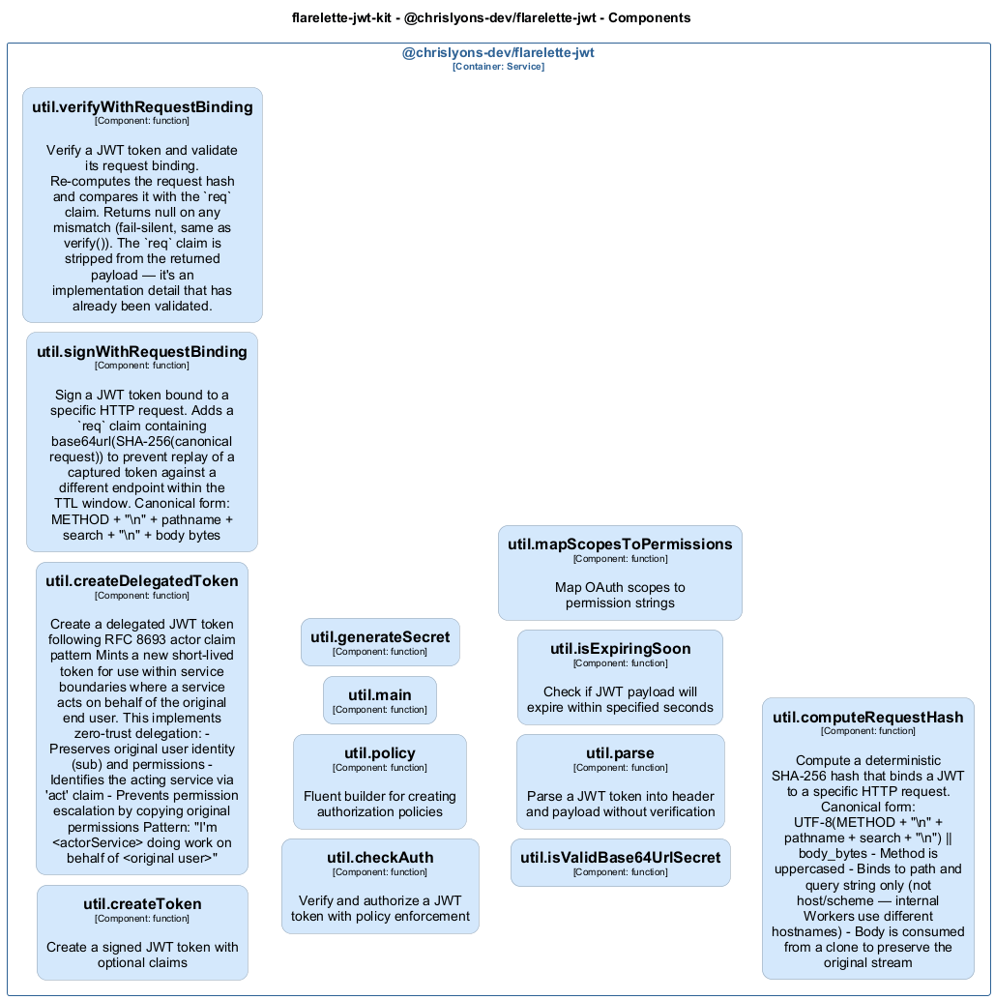
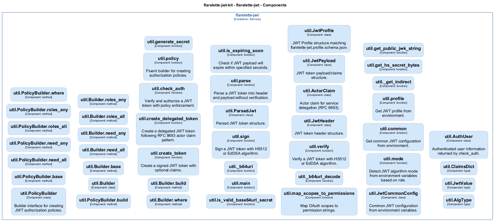

# util — Code View

[← Back to Container](./flarelette_jwt.md) | [← Back to System](./README.md)

---

## Component Information

| Field | Value |
| --- | --- |
| **Component** | util |
| **Container** | flarelette-jwt |
| **Type** | `module` |
| **Description** | Environment Configuration for JWT Operations<br><br>This module provides functions to read environment variables and derive JWT-related configurations.<br>It supports both symmetric (HS512) and asymmetric (EdDSA) algorithms. |
---

## Code Structure

### Class Diagram




### Code Elements

<details>
<summary><strong>47 code element(s)</strong></summary>


#### Classes

##### `JwtHeader`

JWT token header structure.

| Field | Value |
| --- | --- |
| **Type** | `class` |
| **Visibility** | `-` |
| **Location** | `C:\Users\chris\git\flarelette-jwt-kit\packages\flarelette-jwt-py\flarelette_jwt\env.py:35` |


---
##### `ActorClaim`

Actor claim for service delegation (RFC 8693).

| Field | Value |
| --- | --- |
| **Type** | `class` |
| **Visibility** | `-` |
| **Location** | `C:\Users\chris\git\flarelette-jwt-kit\packages\flarelette-jwt-py\flarelette_jwt\env.py:51` |


---
##### `JwtPayload`

JWT token payload/claims structure.

| Field | Value |
| --- | --- |
| **Type** | `class` |
| **Visibility** | `-` |
| **Location** | `C:\Users\chris\git\flarelette-jwt-kit\packages\flarelette-jwt-py\flarelette_jwt\env.py:70` |


---
##### `JwtProfile`

JWT Profile structure matching flarelette-jwt.profile.schema.json.

| Field | Value |
| --- | --- |
| **Type** | `class` |
| **Visibility** | `-` |
| **Location** | `C:\Users\chris\git\flarelette-jwt-kit\packages\flarelette-jwt-py\flarelette_jwt\env.py:112` |


---
##### `JwtCommonConfig`

Common JWT configuration from environment variables.

| Field | Value |
| --- | --- |
| **Type** | `class` |
| **Visibility** | `-` |
| **Location** | `C:\Users\chris\git\flarelette-jwt-kit\packages\flarelette-jwt-py\flarelette_jwt\env.py:127` |


---
##### `AuthUser`

Authenticated user information returned by check_auth.

| Field | Value |
| --- | --- |
| **Type** | `class` |
| **Visibility** | `-` |
| **Location** | `C:\Users\chris\git\flarelette-jwt-kit\packages\flarelette-jwt-py\flarelette_jwt\high.py:24` |


---
##### `PolicyBuilder`

Builder interface for creating JWT authorization policies.

| Field | Value |
| --- | --- |
| **Type** | `class` |
| **Visibility** | `-` |
| **Location** | `C:\Users\chris\git\flarelette-jwt-kit\packages\flarelette-jwt-py\flarelette_jwt\high.py:40` |


---
##### `Builder`


| Field | Value |
| --- | --- |
| **Type** | `class` |
| **Visibility** | `-` |
| **Location** | `C:\Users\chris\git\flarelette-jwt-kit\packages\flarelette-jwt-py\flarelette_jwt\high.py:227` |


---
##### `ParsedJwt`

Parsed JWT token structure.

| Field | Value |
| --- | --- |
| **Type** | `class` |
| **Visibility** | `-` |
| **Location** | `C:\Users\chris\git\flarelette-jwt-kit\packages\flarelette-jwt-py\flarelette_jwt\util.py:19` |


---

#### Functions

##### `mode()`

Detect JWT algorithm mode from environment variables based on role.

| Field | Value |
| --- | --- |
| **Type** | `function` |
| **Visibility** | `-` |
| **Returns** | `AlgType` - Either "HS512" or "EdDSA" || **Location** | `C:\Users\chris\git\flarelette-jwt-kit\packages\flarelette-jwt-py\flarelette_jwt\env.py:141` |

**Parameters:**

- `role`: <code>str</code> — Either "producer" (signing) or "consumer" (verification)

---
##### `common()`

Get common JWT configuration from environment.

| Field | Value |
| --- | --- |
| **Type** | `function` |
| **Visibility** | `-` |
| **Returns** | `JwtCommonConfig` - Configuration with iss, aud, leeway, ttl_seconds || **Location** | `C:\Users\chris\git\flarelette-jwt-kit\packages\flarelette-jwt-py\flarelette_jwt\env.py:182` |


---
##### `profile()`

Get JWT profile from environment.

| Field | Value |
| --- | --- |
| **Type** | `function` |
| **Visibility** | `-` |
| **Returns** | `dict[str, Any]` - dict containing alg, iss, aud, leeway_seconds, and ttl_seconds || **Location** | `C:\Users\chris\git\flarelette-jwt-kit\packages\flarelette-jwt-py\flarelette_jwt\env.py:196` |

**Parameters:**

- `role`: <code>str</code> — Either "producer" (signing) or "consumer" (verification)

---
##### `_get_indirect()`


| Field | Value |
| --- | --- |
| **Type** | `function` |
| **Visibility** | `-` |
| **Returns** | `str \| None` || **Location** | `C:\Users\chris\git\flarelette-jwt-kit\packages\flarelette-jwt-py\flarelette_jwt\env.py:219` |

**Parameters:**

- `name_var`: <code>str</code>- `direct_var`: <code>str</code>

---
##### `get_hs_secret_bytes()`


| Field | Value |
| --- | --- |
| **Type** | `function` |
| **Visibility** | `-` |
| **Returns** | `bytes` || **Location** | `C:\Users\chris\git\flarelette-jwt-kit\packages\flarelette-jwt-py\flarelette_jwt\env.py:226` |


---
##### `get_public_jwk_string()`


| Field | Value |
| --- | --- |
| **Type** | `function` |
| **Visibility** | `-` |
| **Returns** | `str \| None` || **Location** | `C:\Users\chris\git\flarelette-jwt-kit\packages\flarelette-jwt-py\flarelette_jwt\env.py:254` |


---
##### `get_jwks_url()`


| Field | Value |
| --- | --- |
| **Type** | `function` |
| **Visibility** | `-` |
| **Returns** | `str \| None` || **Location** | `C:\Users\chris\git\flarelette-jwt-kit\packages\flarelette-jwt-py\flarelette_jwt\env.py:258` |


---
##### `create_token()`

Create a signed JWT token with optional claims.

| Field | Value |
| --- | --- |
| **Type** | `function` |
| **Visibility** | `-` |
| **Async** | Yes || **Returns** | `str` - Signed JWT token string || **Location** | `C:\Users\chris\git\flarelette-jwt-kit\packages\flarelette-jwt-py\flarelette_jwt\high.py:58` |

**Parameters:**

- `claims`: <code>JwtPayload</code> — Claims to include in the token (can include custom claims beyond standard JWT fields)

---
##### `create_delegated_token()`

Create a delegated JWT token following RFC 8693 actor claim pattern.

| Field | Value |
| --- | --- |
| **Type** | `function` |
| **Visibility** | `-` |
| **Async** | Yes || **Returns** | `str` - Signed JWT token string with delegation claim<br><br>See Also:<br>    - RFC 8693: OAuth 2.0 Token Exchange<br>    - security.md: Service Delegation Pattern section || **Location** | `C:\Users\chris\git\flarelette-jwt-kit\packages\flarelette-jwt-py\flarelette_jwt\high.py:79` |

**Parameters:**

- `original_payload`: <code>JwtPayload</code> — The verified JWT payload from external auth (e.g., Auth0)- `actor_service`: <code>str</code> — Identifier of the service creating this delegated token
**Examples:**
```typescript

```

---
##### `check_auth()`

Verify and authorize a JWT token with policy enforcement.

| Field | Value |
| --- | --- |
| **Type** | `function` |
| **Visibility** | `-` |
| **Async** | Yes || **Returns** | `AuthUser \| None` - AuthUser if valid and authorized, None otherwise || **Location** | `C:\Users\chris\git\flarelette-jwt-kit\packages\flarelette-jwt-py\flarelette_jwt\high.py:166` |

**Parameters:**

- `token`: <code>str</code> — JWT token string to verify

---
##### `policy()`

Fluent builder for creating authorization policies.

| Field | Value |
| --- | --- |
| **Type** | `function` |
| **Visibility** | `-` |
| **Returns** | `PolicyBuilder` - PolicyBuilder with chainable methods || **Location** | `C:\Users\chris\git\flarelette-jwt-kit\packages\flarelette-jwt-py\flarelette_jwt\high.py:219` |


---
##### `generate_secret()`


| Field | Value |
| --- | --- |
| **Type** | `function` |
| **Visibility** | `-` |
| **Returns** | `str` || **Location** | `C:\Users\chris\git\flarelette-jwt-kit\packages\flarelette-jwt-py\flarelette_jwt\secret.py:18` |

**Parameters:**

- `length_bytes`: <code>int</code>

---
##### `is_valid_base64url_secret()`


| Field | Value |
| --- | --- |
| **Type** | `function` |
| **Visibility** | `-` |
| **Returns** | `bool` || **Location** | `C:\Users\chris\git\flarelette-jwt-kit\packages\flarelette-jwt-py\flarelette_jwt\secret.py:23` |

**Parameters:**

- `secret`: <code>str</code>- `min_bytes`: <code>int</code>

---
##### `main()`


| Field | Value |
| --- | --- |
| **Type** | `function` |
| **Visibility** | `-` |
| **Returns** | `int` || **Location** | `C:\Users\chris\git\flarelette-jwt-kit\packages\flarelette-jwt-py\flarelette_jwt\secret.py:32` |

**Parameters:**

- `argv`: <code>list[str] | None</code>

---
##### `_b64url()`


| Field | Value |
| --- | --- |
| **Type** | `function` |
| **Visibility** | `-` |
| **Returns** | `str` || **Location** | `C:\Users\chris\git\flarelette-jwt-kit\packages\flarelette-jwt-py\flarelette_jwt\sign.py:21` |

**Parameters:**

- `b`: <code>bytes</code>

---
##### `sign()`

Sign a JWT token with HS512 or EdDSA algorithm.

| Field | Value |
| --- | --- |
| **Type** | `function` |
| **Visibility** | `-` |
| **Async** | Yes || **Returns** | `str` - Signed JWT token string || **Location** | `C:\Users\chris\git\flarelette-jwt-kit\packages\flarelette-jwt-py\flarelette_jwt\sign.py:25` |

**Parameters:**

- `payload`: <code>JwtPayload</code> — Claims to include in the token (can include custom claims beyond standard JWT fields)

---
##### `parse()`

Parse a JWT token into header and payload without verification.

| Field | Value |
| --- | --- |
| **Type** | `function` |
| **Visibility** | `-` |
| **Returns** | `ParsedJwt` - Dictionary with 'header' and 'payload' keys || **Location** | `C:\Users\chris\git\flarelette-jwt-kit\packages\flarelette-jwt-py\flarelette_jwt\util.py:31` |

**Parameters:**

- `token`: <code>str</code> — JWT token string

---
##### `is_expiring_soon()`

Check if JWT payload will expire within specified seconds.

| Field | Value |
| --- | --- |
| **Type** | `function` |
| **Visibility** | `-` |
| **Returns** | `bool` - True if token expires within the threshold || **Location** | `C:\Users\chris\git\flarelette-jwt-kit\packages\flarelette-jwt-py\flarelette_jwt\util.py:49` |

**Parameters:**

- `payload`: <code>JwtPayload</code> — JWT payload with 'exp' claim- `seconds`: <code>int</code> — Number of seconds threshold

---
##### `map_scopes_to_permissions()`

Map OAuth scopes to permission strings.

| Field | Value |
| --- | --- |
| **Type** | `function` |
| **Visibility** | `-` |
| **Returns** | `list[str]` - List of permission strings (currently identity mapping) || **Location** | `C:\Users\chris\git\flarelette-jwt-kit\packages\flarelette-jwt-py\flarelette_jwt\util.py:63` |

**Parameters:**

- `scopes`: <code>list[str]</code> — List of OAuth scope strings

---
##### `_b64url_decode()`


| Field | Value |
| --- | --- |
| **Type** | `function` |
| **Visibility** | `-` |
| **Returns** | `bytes` || **Location** | `C:\Users\chris\git\flarelette-jwt-kit\packages\flarelette-jwt-py\flarelette_jwt\verify.py:35` |

**Parameters:**

- `s`: <code>str</code>

---
##### `verify()`

Verify a JWT token with HS512 or EdDSA algorithm.

| Field | Value |
| --- | --- |
| **Type** | `function` |
| **Visibility** | `-` |
| **Async** | Yes || **Returns** | `JwtPayload \| None` - Decoded payload if valid, None otherwise || **Location** | `C:\Users\chris\git\flarelette-jwt-kit\packages\flarelette-jwt-py\flarelette_jwt\verify.py:39` |

**Parameters:**

- `token`: <code>str</code> — JWT token string to verify

---

</details>

---

<div align="center">
<sub><a href="./flarelette_jwt.md">← Back to Container</a> | <a href="./README.md">← Back to System</a> | Generated with <a href="https://github.com/chrislyons-dev/archlette">Archlette</a></sub>
</div>

