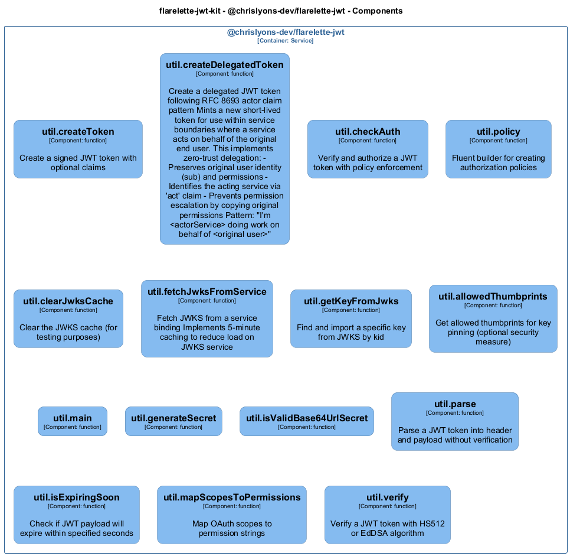
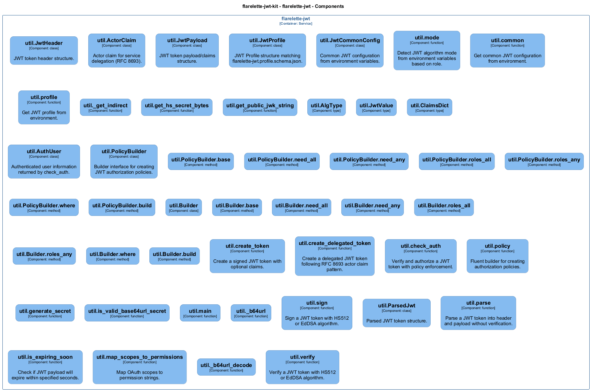

# util — Code View

[← Back to Container](./flarelette_jwt.md) | [← Back to System](./README.md)

---

## Component Information

<table>
<tbody>
<tr>
<td><strong>Component</strong></td>
<td>util</td>
</tr>
<tr>
<td><strong>Container</strong></td>
<td>flarelette-jwt</td>
</tr>
<tr>
<td><strong>Type</strong></td>
<td><code>module</code></td>
</tr>
<tr>
<td><strong>Description</strong></td>
<td>Environment Configuration for JWT Operations

This module provides functions to read environment variables and derive JWT-related configurations.
It supports both symmetric (HS512) and asymmetric (EdDSA) algorithms.</td>
</tr>
</tbody>
</table>

---

## Code Structure

### Class Diagram




### Code Elements

<details>
<summary><strong>46 code element(s)</strong></summary>


#### Classes

##### `JwtHeader`

JWT token header structure.

<table>
<tbody>
<tr>
<td><strong>Type</strong></td>
<td><code>class</code></td>
</tr>
<tr>
<td><strong>Visibility</strong></td>
<td><code></code></td>
</tr>
<tr>
<td><strong>Location</strong></td>
<td><code>C:\Users\chris\git\flarelette-jwt-kit\packages\flarelette-jwt-py\flarelette_jwt\env.py:35</code></td>
</tr>
</tbody>
</table>


---
##### `ActorClaim`

Actor claim for service delegation (RFC 8693).

<table>
<tbody>
<tr>
<td><strong>Type</strong></td>
<td><code>class</code></td>
</tr>
<tr>
<td><strong>Visibility</strong></td>
<td><code></code></td>
</tr>
<tr>
<td><strong>Location</strong></td>
<td><code>C:\Users\chris\git\flarelette-jwt-kit\packages\flarelette-jwt-py\flarelette_jwt\env.py:49</code></td>
</tr>
</tbody>
</table>


---
##### `JwtPayload`

JWT token payload/claims structure.

<table>
<tbody>
<tr>
<td><strong>Type</strong></td>
<td><code>class</code></td>
</tr>
<tr>
<td><strong>Visibility</strong></td>
<td><code></code></td>
</tr>
<tr>
<td><strong>Location</strong></td>
<td><code>C:\Users\chris\git\flarelette-jwt-kit\packages\flarelette-jwt-py\flarelette_jwt\env.py:66</code></td>
</tr>
</tbody>
</table>


---
##### `JwtProfile`

JWT Profile structure matching flarelette-jwt.profile.schema.json.

<table>
<tbody>
<tr>
<td><strong>Type</strong></td>
<td><code>class</code></td>
</tr>
<tr>
<td><strong>Visibility</strong></td>
<td><code></code></td>
</tr>
<tr>
<td><strong>Location</strong></td>
<td><code>C:\Users\chris\git\flarelette-jwt-kit\packages\flarelette-jwt-py\flarelette_jwt\env.py:108</code></td>
</tr>
</tbody>
</table>


---
##### `JwtCommonConfig`

Common JWT configuration from environment variables.

<table>
<tbody>
<tr>
<td><strong>Type</strong></td>
<td><code>class</code></td>
</tr>
<tr>
<td><strong>Visibility</strong></td>
<td><code></code></td>
</tr>
<tr>
<td><strong>Location</strong></td>
<td><code>C:\Users\chris\git\flarelette-jwt-kit\packages\flarelette-jwt-py\flarelette_jwt\env.py:123</code></td>
</tr>
</tbody>
</table>


---
##### `AuthUser`

Authenticated user information returned by check_auth.

<table>
<tbody>
<tr>
<td><strong>Type</strong></td>
<td><code>class</code></td>
</tr>
<tr>
<td><strong>Visibility</strong></td>
<td><code></code></td>
</tr>
<tr>
<td><strong>Location</strong></td>
<td><code>C:\Users\chris\git\flarelette-jwt-kit\packages\flarelette-jwt-py\flarelette_jwt\high.py:24</code></td>
</tr>
</tbody>
</table>


---
##### `PolicyBuilder`

Builder interface for creating JWT authorization policies.

<table>
<tbody>
<tr>
<td><strong>Type</strong></td>
<td><code>class</code></td>
</tr>
<tr>
<td><strong>Visibility</strong></td>
<td><code></code></td>
</tr>
<tr>
<td><strong>Location</strong></td>
<td><code>C:\Users\chris\git\flarelette-jwt-kit\packages\flarelette-jwt-py\flarelette_jwt\high.py:40</code></td>
</tr>
</tbody>
</table>


---
##### `Builder`


<table>
<tbody>
<tr>
<td><strong>Type</strong></td>
<td><code>class</code></td>
</tr>
<tr>
<td><strong>Visibility</strong></td>
<td><code></code></td>
</tr>
<tr>
<td><strong>Location</strong></td>
<td><code>C:\Users\chris\git\flarelette-jwt-kit\packages\flarelette-jwt-py\flarelette_jwt\high.py:217</code></td>
</tr>
</tbody>
</table>


---
##### `ParsedJwt`

Parsed JWT token structure.

<table>
<tbody>
<tr>
<td><strong>Type</strong></td>
<td><code>class</code></td>
</tr>
<tr>
<td><strong>Visibility</strong></td>
<td><code></code></td>
</tr>
<tr>
<td><strong>Location</strong></td>
<td><code>C:\Users\chris\git\flarelette-jwt-kit\packages\flarelette-jwt-py\flarelette_jwt\util.py:19</code></td>
</tr>
</tbody>
</table>


---

#### Functions

##### `mode()`

Detect JWT algorithm mode from environment variables based on role.

<table>
<tbody>
<tr>
<td><strong>Type</strong></td>
<td><code>function</code></td>
</tr>
<tr>
<td><strong>Visibility</strong></td>
<td><code></code></td>
</tr>
<tr>
<td><strong>Returns</strong></td>
<td><code>AlgType</code> — Either "HS512" or "EdDSA"</td>
</tr>
<tr>
<td><strong>Location</strong></td>
<td><code>C:\Users\chris\git\flarelette-jwt-kit\packages\flarelette-jwt-py\flarelette_jwt\env.py:137</code></td>
</tr>
</tbody>
</table>

**Parameters:**

- `role`: <code>str</code> — Either "producer" (signing) or "consumer" (verification)

---
##### `common()`

Get common JWT configuration from environment.

<table>
<tbody>
<tr>
<td><strong>Type</strong></td>
<td><code>function</code></td>
</tr>
<tr>
<td><strong>Visibility</strong></td>
<td><code></code></td>
</tr>
<tr>
<td><strong>Returns</strong></td>
<td><code>JwtCommonConfig</code> — Configuration with iss, aud, leeway, ttl_seconds</td>
</tr>
<tr>
<td><strong>Location</strong></td>
<td><code>C:\Users\chris\git\flarelette-jwt-kit\packages\flarelette-jwt-py\flarelette_jwt\env.py:167</code></td>
</tr>
</tbody>
</table>


---
##### `profile()`

Get JWT profile from environment.

<table>
<tbody>
<tr>
<td><strong>Type</strong></td>
<td><code>function</code></td>
</tr>
<tr>
<td><strong>Visibility</strong></td>
<td><code></code></td>
</tr>
<tr>
<td><strong>Returns</strong></td>
<td><code>dict[str, Any]</code> — dict containing alg, iss, aud, leeway_seconds, and ttl_seconds</td>
</tr>
<tr>
<td><strong>Location</strong></td>
<td><code>C:\Users\chris\git\flarelette-jwt-kit\packages\flarelette-jwt-py\flarelette_jwt\env.py:181</code></td>
</tr>
</tbody>
</table>

**Parameters:**

- `role`: <code>str</code> — Either "producer" (signing) or "consumer" (verification)

---
##### `_get_indirect()`


<table>
<tbody>
<tr>
<td><strong>Type</strong></td>
<td><code>function</code></td>
</tr>
<tr>
<td><strong>Visibility</strong></td>
<td><code></code></td>
</tr>
<tr>
<td><strong>Returns</strong></td>
<td><code>str | None</code></td>
</tr>
<tr>
<td><strong>Location</strong></td>
<td><code>C:\Users\chris\git\flarelette-jwt-kit\packages\flarelette-jwt-py\flarelette_jwt\env.py:204</code></td>
</tr>
</tbody>
</table>

**Parameters:**

- `name_var`: <code>str</code>- `direct_var`: <code>str</code>

---
##### `get_hs_secret_bytes()`


<table>
<tbody>
<tr>
<td><strong>Type</strong></td>
<td><code>function</code></td>
</tr>
<tr>
<td><strong>Visibility</strong></td>
<td><code></code></td>
</tr>
<tr>
<td><strong>Returns</strong></td>
<td><code>bytes</code></td>
</tr>
<tr>
<td><strong>Location</strong></td>
<td><code>C:\Users\chris\git\flarelette-jwt-kit\packages\flarelette-jwt-py\flarelette_jwt\env.py:211</code></td>
</tr>
</tbody>
</table>


---
##### `get_public_jwk_string()`


<table>
<tbody>
<tr>
<td><strong>Type</strong></td>
<td><code>function</code></td>
</tr>
<tr>
<td><strong>Visibility</strong></td>
<td><code></code></td>
</tr>
<tr>
<td><strong>Returns</strong></td>
<td><code>str | None</code></td>
</tr>
<tr>
<td><strong>Location</strong></td>
<td><code>C:\Users\chris\git\flarelette-jwt-kit\packages\flarelette-jwt-py\flarelette_jwt\env.py:226</code></td>
</tr>
</tbody>
</table>


---
##### `create_token()`

Create a signed JWT token with optional claims.

<table>
<tbody>
<tr>
<td><strong>Type</strong></td>
<td><code>function</code></td>
</tr>
<tr>
<td><strong>Visibility</strong></td>
<td><code></code></td>
</tr>
<tr>
<td><strong>Async</strong></td>
<td>Yes</td>
</tr>
<tr>
<td><strong>Returns</strong></td>
<td><code>str</code> — Signed JWT token string</td>
</tr>
<tr>
<td><strong>Location</strong></td>
<td><code>C:\Users\chris\git\flarelette-jwt-kit\packages\flarelette-jwt-py\flarelette_jwt\high.py:58</code></td>
</tr>
</tbody>
</table>

**Parameters:**

- `claims`: <code>dict</code> — Custom claims to include in the token

---
##### `create_delegated_token()`

Create a delegated JWT token following RFC 8693 actor claim pattern.

<table>
<tbody>
<tr>
<td><strong>Type</strong></td>
<td><code>function</code></td>
</tr>
<tr>
<td><strong>Visibility</strong></td>
<td><code></code></td>
</tr>
<tr>
<td><strong>Async</strong></td>
<td>Yes</td>
</tr>
<tr>
<td><strong>Returns</strong></td>
<td><code>str</code> — Signed JWT token string with delegation claim

See Also:
    - RFC 8693: OAuth 2.0 Token Exchange
    - security.md: Service Delegation Pattern section</td>
</tr>
<tr>
<td><strong>Location</strong></td>
<td><code>C:\Users\chris\git\flarelette-jwt-kit\packages\flarelette-jwt-py\flarelette_jwt\high.py:79</code></td>
</tr>
</tbody>
</table>

**Parameters:**

- `original_payload`: <code>dict[str, JwtValue]</code> — The verified JWT payload from external auth (e.g., Auth0)- `actor_service`: <code>str</code> — Identifier of the service creating this delegated token
**Examples:**
```typescript

```

---
##### `check_auth()`

Verify and authorize a JWT token with policy enforcement.

<table>
<tbody>
<tr>
<td><strong>Type</strong></td>
<td><code>function</code></td>
</tr>
<tr>
<td><strong>Visibility</strong></td>
<td><code></code></td>
</tr>
<tr>
<td><strong>Async</strong></td>
<td>Yes</td>
</tr>
<tr>
<td><strong>Returns</strong></td>
<td><code>AuthUser | None</code> — AuthUser if valid and authorized, None otherwise</td>
</tr>
<tr>
<td><strong>Location</strong></td>
<td><code>C:\Users\chris\git\flarelette-jwt-kit\packages\flarelette-jwt-py\flarelette_jwt\high.py:156</code></td>
</tr>
</tbody>
</table>

**Parameters:**

- `token`: <code>str</code> — JWT token string to verify

---
##### `policy()`

Fluent builder for creating authorization policies.

<table>
<tbody>
<tr>
<td><strong>Type</strong></td>
<td><code>function</code></td>
</tr>
<tr>
<td><strong>Visibility</strong></td>
<td><code></code></td>
</tr>
<tr>
<td><strong>Returns</strong></td>
<td><code>PolicyBuilder</code> — PolicyBuilder with chainable methods</td>
</tr>
<tr>
<td><strong>Location</strong></td>
<td><code>C:\Users\chris\git\flarelette-jwt-kit\packages\flarelette-jwt-py\flarelette_jwt\high.py:209</code></td>
</tr>
</tbody>
</table>


---
##### `generate_secret()`


<table>
<tbody>
<tr>
<td><strong>Type</strong></td>
<td><code>function</code></td>
</tr>
<tr>
<td><strong>Visibility</strong></td>
<td><code></code></td>
</tr>
<tr>
<td><strong>Returns</strong></td>
<td><code>str</code></td>
</tr>
<tr>
<td><strong>Location</strong></td>
<td><code>C:\Users\chris\git\flarelette-jwt-kit\packages\flarelette-jwt-py\flarelette_jwt\secret.py:18</code></td>
</tr>
</tbody>
</table>

**Parameters:**

- `length_bytes`: <code>int</code>

---
##### `is_valid_base64url_secret()`


<table>
<tbody>
<tr>
<td><strong>Type</strong></td>
<td><code>function</code></td>
</tr>
<tr>
<td><strong>Visibility</strong></td>
<td><code></code></td>
</tr>
<tr>
<td><strong>Returns</strong></td>
<td><code>bool</code></td>
</tr>
<tr>
<td><strong>Location</strong></td>
<td><code>C:\Users\chris\git\flarelette-jwt-kit\packages\flarelette-jwt-py\flarelette_jwt\secret.py:23</code></td>
</tr>
</tbody>
</table>

**Parameters:**

- `secret`: <code>str</code>- `min_bytes`: <code>int</code>

---
##### `main()`


<table>
<tbody>
<tr>
<td><strong>Type</strong></td>
<td><code>function</code></td>
</tr>
<tr>
<td><strong>Visibility</strong></td>
<td><code></code></td>
</tr>
<tr>
<td><strong>Returns</strong></td>
<td><code>int</code></td>
</tr>
<tr>
<td><strong>Location</strong></td>
<td><code>C:\Users\chris\git\flarelette-jwt-kit\packages\flarelette-jwt-py\flarelette_jwt\secret.py:32</code></td>
</tr>
</tbody>
</table>

**Parameters:**

- `argv`: <code>list[str] | None</code>

---
##### `_b64url()`


<table>
<tbody>
<tr>
<td><strong>Type</strong></td>
<td><code>function</code></td>
</tr>
<tr>
<td><strong>Visibility</strong></td>
<td><code></code></td>
</tr>
<tr>
<td><strong>Returns</strong></td>
<td><code>str</code></td>
</tr>
<tr>
<td><strong>Location</strong></td>
<td><code>C:\Users\chris\git\flarelette-jwt-kit\packages\flarelette-jwt-py\flarelette_jwt\sign.py:21</code></td>
</tr>
</tbody>
</table>

**Parameters:**

- `b`: <code>bytes</code>

---
##### `sign()`

Sign a JWT token with HS512 or EdDSA algorithm.

<table>
<tbody>
<tr>
<td><strong>Type</strong></td>
<td><code>function</code></td>
</tr>
<tr>
<td><strong>Visibility</strong></td>
<td><code></code></td>
</tr>
<tr>
<td><strong>Async</strong></td>
<td>Yes</td>
</tr>
<tr>
<td><strong>Returns</strong></td>
<td><code>str</code> — Signed JWT token string</td>
</tr>
<tr>
<td><strong>Location</strong></td>
<td><code>C:\Users\chris\git\flarelette-jwt-kit\packages\flarelette-jwt-py\flarelette_jwt\sign.py:25</code></td>
</tr>
</tbody>
</table>

**Parameters:**

- `payload`: <code>dict</code> — Claims to include in the token

---
##### `parse()`

Parse a JWT token into header and payload without verification.

<table>
<tbody>
<tr>
<td><strong>Type</strong></td>
<td><code>function</code></td>
</tr>
<tr>
<td><strong>Visibility</strong></td>
<td><code></code></td>
</tr>
<tr>
<td><strong>Returns</strong></td>
<td><code>ParsedJwt</code> — Dictionary with 'header' and 'payload' keys</td>
</tr>
<tr>
<td><strong>Location</strong></td>
<td><code>C:\Users\chris\git\flarelette-jwt-kit\packages\flarelette-jwt-py\flarelette_jwt\util.py:31</code></td>
</tr>
</tbody>
</table>

**Parameters:**

- `token`: <code>str</code> — JWT token string

---
##### `is_expiring_soon()`

Check if JWT payload will expire within specified seconds.

<table>
<tbody>
<tr>
<td><strong>Type</strong></td>
<td><code>function</code></td>
</tr>
<tr>
<td><strong>Visibility</strong></td>
<td><code></code></td>
</tr>
<tr>
<td><strong>Returns</strong></td>
<td><code>bool</code> — True if token expires within the threshold</td>
</tr>
<tr>
<td><strong>Location</strong></td>
<td><code>C:\Users\chris\git\flarelette-jwt-kit\packages\flarelette-jwt-py\flarelette_jwt\util.py:49</code></td>
</tr>
</tbody>
</table>

**Parameters:**

- `payload`: <code>JwtPayload</code> — JWT payload with 'exp' claim- `seconds`: <code>int</code> — Number of seconds threshold

---
##### `map_scopes_to_permissions()`

Map OAuth scopes to permission strings.

<table>
<tbody>
<tr>
<td><strong>Type</strong></td>
<td><code>function</code></td>
</tr>
<tr>
<td><strong>Visibility</strong></td>
<td><code></code></td>
</tr>
<tr>
<td><strong>Returns</strong></td>
<td><code>list[str]</code> — List of permission strings (currently identity mapping)</td>
</tr>
<tr>
<td><strong>Location</strong></td>
<td><code>C:\Users\chris\git\flarelette-jwt-kit\packages\flarelette-jwt-py\flarelette_jwt\util.py:63</code></td>
</tr>
</tbody>
</table>

**Parameters:**

- `scopes`: <code>list[str]</code> — List of OAuth scope strings

---
##### `_b64url_decode()`


<table>
<tbody>
<tr>
<td><strong>Type</strong></td>
<td><code>function</code></td>
</tr>
<tr>
<td><strong>Visibility</strong></td>
<td><code></code></td>
</tr>
<tr>
<td><strong>Returns</strong></td>
<td><code>bytes</code></td>
</tr>
<tr>
<td><strong>Location</strong></td>
<td><code>C:\Users\chris\git\flarelette-jwt-kit\packages\flarelette-jwt-py\flarelette_jwt\verify.py:29</code></td>
</tr>
</tbody>
</table>

**Parameters:**

- `s`: <code>str</code>

---
##### `verify()`

Verify a JWT token with HS512 or EdDSA algorithm.

<table>
<tbody>
<tr>
<td><strong>Type</strong></td>
<td><code>function</code></td>
</tr>
<tr>
<td><strong>Visibility</strong></td>
<td><code></code></td>
</tr>
<tr>
<td><strong>Async</strong></td>
<td>Yes</td>
</tr>
<tr>
<td><strong>Returns</strong></td>
<td><code>JwtPayload | None</code> — Decoded payload if valid, None otherwise</td>
</tr>
<tr>
<td><strong>Location</strong></td>
<td><code>C:\Users\chris\git\flarelette-jwt-kit\packages\flarelette-jwt-py\flarelette_jwt\verify.py:33</code></td>
</tr>
</tbody>
</table>

**Parameters:**

- `token`: <code>str</code> — JWT token string to verify

---

</details>

---

<div align="center">
<sub><a href="./flarelette_jwt.md">← Back to Container</a> | <a href="./README.md">← Back to System</a> | Generated with <a href="https://github.com/chrislyons-dev/archlette">Archlette</a></sub>
</div>
